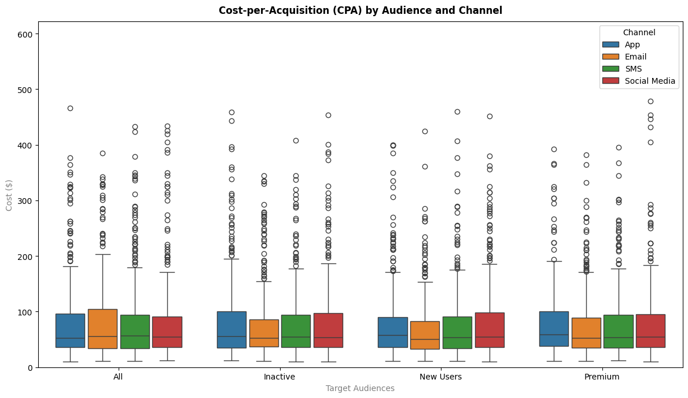

# **Blinkit: A Q-Commerce Case Study**
***Theerathorn Tapanakulsak***
  <table>
    <tr>
      <td>
		<h2>Abstract</h2>
        
This study analyzes 5,400 entries of marketing campaigns between March 2023 and November 2024 by Blinkit, a Q-Commerce platform operating in India's big cities. The project identifies performance factors across four digital channels, nine campaign types, and four audience segments. It also addresses two questions in digital marketing optimization: which factors have the leading influence on campaign performance, and how to optimize them to achieve a sustained competitive advantage.
        
This project utilizes data published on Kaggle by user YASH MOTIANI. Each record captures essential campaign metrics, including campaign name, target audience segmentation, marketing channel, impressions, click-through rates, conversion rates, campaign costs, revenue generated, and return on advertising spend (ROAS).
        
The data reveals two types of factors influencing a campaign's performance, universal and campaign-specific factors. A universal factor consistently affects a campaign's efficacy across all campaign types, audience segments, and channels. It comprises seasonal timing, day-of-week period, marketing situations, audiences' characteristics, and channel structure. Among them, temporal timings, both seasonality and day-of-week period, emerge as the most systematically implementable factors. Q3 (October-December) consistently delivers peak performance across most campaign types as festive shopping behavior increases customers' spending and campaign reception. Conversely, Q1 (April-June) presents significant challenges with elevated CPA and reduced ROI. Aside from quarterly patterns, there are specific weekly templates to follow. Monday is the optimal day to launch campaigns to generate a weekly trend. Intense competition peaks on Wednesday, making it the most expensive day (15-30% higher) for acquiring new customers. Engagement reaches its peak during Wednesday and Thursday, while Friday delivers quality traffic, achieving a high conversion rate despite having lower click volumes.
        
On the other hand, campaign-specific factor exhibits different patterns and sensitivity in each campaign, despite all general factors remaining identical. The examples are seasonal dependency, campaign fatigue rate, and audience-channel matching. Seasonal-dependent campaigns are campaigns that rely on urgency and immediate messaging during a definite period to perform well, but fail to generate compelling actions during routine purchasing cycles. Push Notification Campaigns demonstrate extreme seasonal-dependent performance, with a 150% difference between peak festive performance (155% ROI in November) and tough, non-festive period (62% ROI in June). Campaign fatigue rate illustrates the pace at which target audiences become desensitized to the same campaign messages and creative content, thus reducing users' engagement and campaign effectiveness. Flash Sale Campaigns demonstrate the highest annual creative fatigue rate, with a 35% annual CTR decline indicating customers' desensitization to urgency-based promotional tactics. Audience-channel alignment is the channel delivering the best performance, conveying campaign messaging to targeted audiences. Each channel performs differently in the same campaign targeting the same segment.
        
The analysis identifies <b><u>Campaign-Specific Factor</u></b> to be a dominant performance determinant, exerting larger impacts on performance under identical general conditions. Correlation analysis shows a suspicious result of extremely weak correlation between all metrics. Upon performing a detailed examination for each audience segment, the data reveals Simpson's Paradox, in which each correlation pair has positive and negative correlation values that sum up to nearly zero. The finding provides a critical warning against relying solely on aggregated performance metrics, as they systematically misrepresent the realities at the segment level. Campaigns that appear to be successful overall, but fail catastrophically with a specific audience segment through a particular channel.
        
Therefore, the optimization framework to achieve a sustained competitive strength should prioritize campaign-specific factor refinements over adjusting general factors. To optimize campaign-specific factors, organizations should abandon traditional approaches that apply general settings to all campaigns and shift to dynamic, context-specific approaches that utilize analyzed data to identify optimal strategic planning. They should implement segment analysis to determine optimal audience-channel alignment for each campaign, and set a campaign-appropriate creative refresh cycle to mitigate the campaign fatigue effect. Deploy real-time monitoring systems to track performance with automated alerts when metrics deviate from the tolerable ranges. Organizations should make quick and reasonable decisions to pause historically successful campaigns when available data and analysis indicate deterioration, and relocate budget away from previously excelled channel-audience combinations when deemed inefficient. 
        
The research demonstrates the larger impact of campaign-specific factors on performance variations than those produced by general environmental factors. It also provides an empirical example of how Simpson's Paradox manifests in real-world marketing data, creating a misleading interpretation. The project suggests that achieving a sustainable competitive advantage requires developing expertise in three domains: analytical sophistication, strategic planning, and agile adaptability. The organization should analyze and extract relevant insight from the obscured and aggregated data to avoid using incorrect data for strategic planning. It should optimize operational strategies by distributing the highest resources to the best-performing channel-audience combination, rather than diffusing efforts across all possible choices and improvements. Finally, it should respond to change quickly and intelligently when the real-time monitoring system indicates metrics deviation from the acceptable ranges. Organizations that master these capabilities with continuous adaptive management for campaign-specific factors will achieve consistent performance advantages and will thrive in this intense digital marketing landscape.
		
 

      </td>
    </tr>
  </table>

## Introduction

Blinkit operates in the Q-Commerce sector, a specialized form of e-commerce that delivers groceries and essentials within minutes of online ordering. Founded in 2013 by Albinder Dhindsa and Saurabh Kumar as Grofers, the company pivoted in 2021 to ultra-fast delivery, introducing sub-15-minute service and rebranding to Blinkit to reflect its quick-commerce focus. Without physical storefronts, these businesses rely exclusively on online marketing to reach customers.

Online marketing fundamentally differs from traditional approaches in two key areas: audience interaction and performance measurement. Digital campaigns enable real-time, two-way communication between brands and customers through highly targeted, personalized content delivered via digital channels. Traditional marketing, by contrast, uses broad, less personalized messaging through offline mediums like flyers and direct mail. Performance analysis also differs significantly—online marketing provides immediate, granular data, including click-through rates and conversion metrics, allowing for rapid campaign optimization. Traditional methods depend on indirect feedback mechanisms such as surveys and response rates, creating delays that hinder timely adjustments.

This research examines the effectiveness of online marketing campaigns through a comprehensive analysis of Blinkit's real-world business data. The study aims to identify actionable patterns that drive peak performance by systematically evaluating campaign characteristics, engagement metrics, and performance outcomes. The analysis incorporates quantitative measures, including impression rates, click-through rates, and conversion rates. It also covers qualitative factors, including target audience segmentation and campaign typology.

By analyzing authentic business data from Blinkit, this research advances both analytical understanding and practical business intelligence applications. The study provides valuable insights into digital marketing analysis, online marketing strategy development, and data-driven decision-making processes. The findings contribute to academic knowledge while offering practical guidance for optimizing marketing campaigns to achieve superior outcomes in the digital marketplace.

## Data

The analysis utilizes a comprehensive dataset published on [Kaggle](https://www.kaggle.com/datasets/yashmotiani/blinkit-marketing-and-customer-powerbi-dashbord), by user YASH MOTIANI, originally designed for machine learning applications in demand prediction, price optimization, and business intelligence insights.

The dataset contains 5,400 campaign records spanning March 2023 to November 2024, providing nearly two years of marketing performance data. Each record captures essential campaign metrics, including campaign name, target audience segmentation, marketing channel, impressions, click-through rates, conversion rates, campaign costs, revenue generated, and return on advertising spend (ROAS).

## Metrics and Analysis

1.  **Exploratory Data Analysis (EDA)**

    1. **Histogram of the numerical data**

        - There are six histograms showing all the numerical data in the dataset. The X-axis is the actual value of each metric, while the Y-axis is the count or frequency of campaigns achieving those values.
          <table>
              <tr>
                  <td style="border: none; text-align: center;">
                      
                  </td>
              </tr>
          </table>
        - All histograms, except spending, show unimodal characteristics. Impressions, clicks, and conversion histograms portray left-skewed distributions as the peak of the graph lies to the right of the center. While revenue and ROAS display right-skewed distributions. Spending has two distinct peaks around 2500 and 3500, suggesting two spending strategies or budget tiers.

    2. **Correlation Analysis**

        - When analyzing the correlation between each metric in the given data, the result shows an extremely weak correlation between all metrics, which seems unusual for this type of information. When grouping and reinterpreting data by targeted audiences, the correlation pattern and the cause of the overall minimal correlation are found.
        - From the segmented metric correlation analysis below, it can be seen that in each row, there are both positive and negative correlations, resulting in cancelling one another when combined, known as **Simpson's Paradox**. This occurs when an aggregated correlation disappears or reaches zero, despite each subgroup having some correlation value.
          <table>
              <tr>
                  <td style="border: none; text-align: center;">
                      
                  </td>
                  <td style="border: none; text-align: center;">
                      
                  </td>
              </tr>
          </table>
        - There are four groups of targeted audiences in this dataset: Inactive, Premium, New Users, and All.

            - **Inactive User Group**: All correlation values are nearly zero, and overall correlations are weakest among all targeted audiences, indicating unpredictable responses. The positive correlation values, in conversion-ROAS correlation (0.036) and impression-ROAS correlation (0.033), indicate the segment responds to the campaigns. Negative correlation values, in clicks-impression (-0.035) and generated revenue-spending (-0.048), suggest the need to adjust the approach rather than increase spending for this group. The data proposes that behavioral prediction and campaign optimization are challenging tasks for this segment because the unreliability of traditional metrics for monitoring the segment's performance requires specialized marketing campaigns and strategies to achieve an advantage in this group.

            - **New User Group**: While the positive correlation between impressions and clicks confirms that basic engagement mechanics work for this segment, the extremely weak correlation value (0.005) indicates significantly lower engagement rates compared to the expectation from more mature customer segments. The positive correlation value between spend and ROAS (0.006) suggests a profitable return from marketing investment. While the weak correlation strength translates to high variability in campaign performance, some campaigns achieve strong efficiency while others fail. The variability signals substantial optimization potential if marketers can identify and replicate the characteristics of successful campaigns. The strategic challenge emerges from a striking paradox in the data. While basic engagement metrics show positive relationships, the negative correlations between clicks and ROAS (-0.081) and between spend and revenue generated (-0.089) reveal that increased engagement activity often fails to translate into profitable outcomes. This suggests that new members are willing to engage with marketing content but are not yet ready for conversion-focused messaging.

            - **Premium User Group**: The positive correlation between spend-clicks (0.048) and spend-conversion (0.030) indicates that they are responsive to marketing campaigns. However, there are also negative correlation values between conversion and revenue generated (-0.089) and spend and revenue generated (-0.023). The negative values result in a concerning paradox, as more conversions are associated with less revenue generation. This scenario suggests several possible causes, including promotional dependency, channel cannibalization, and shifting to lower-value transactions due to marketing pressure. The data indicates the campaigns targeting this segment should focus on quality, not quantity, to improve customers' relationships and transaction values.

            - **All Users Group**: The positive correlation values between spend-revenue (0.048) and conversions-revenue (0.058) demonstrate that fundamental marketing mechanics work effectively for this segment. More marketing investment translates to higher revenue, and increased conversion actions drive proportional revenue growth, confirming that this group represents a financially viable target for scaled marketing efforts. Conversely, the negative correlation values paint a more complex picture: spend-conversions (-0.087), clicks-ROAS (-0.043), and conversions-ROAS (-0.034). All indicate that increased marketing activity is associated with reduced efficiency metrics. This creates an apparent contradiction where higher investment generates revenue but through fewer, higher-value interactions rather than increased engagement volume. Therefore, campaigns targeting this group should prioritize conversion value optimization over conversion volume maximization to avoid overspending.
  

1.  **Campaign Performance Derived Metrics**
     
    1.  **Click-Through Rate (CTR)**

        -   CTR is the percentage of people who click on a particular link or advertisement appearing on the screen. It measures how well an advertisement captures viewers' attention. Nowadays, however, this metric has gradually depreciated in importance due to users' desensitization to advertisements that are displayed ubiquitously on the Internet. The audience's disinterest lowers the clicking chance of the advertisement, reducing the metric's precision and validity. To calculate CTR, the formula is

        $$\boxed{\text{CTR} = \frac{\text{Total Measured Clicks}}{\text{Total Measured Ad Impressions}} \times 100}$$

        <table style="margin-left: auto; margin-right: auto;">
          <tr>
            <td style="text-align: center; border: none">
                
            </td>
            <td style="text-align: center; border: none">
                
            </td>
          </tr>
        </table>

        -   The box plot for CTR by target group and channel demonstrates similar performance of all channels across all audience segments, with median CTR between 9 and 11%. It suggests the comparable effectiveness of these channels regardless of targeted users. However, each channel has significant variability, as shown by the long whisker extensions and numerous outliers. Some campaigns achieve a CTR of over 95%, while others fall below 5%. The outliers indicate that when conditions are right, any channel with any audience can perform exceptionally well. Therefore, the organization should focus on the execution quality rather than channel choice to achieve successful campaigns.

    3.  **Conversion Rate (CVR)**

        -   CVR is the percentage of people who completed a desired action. It measures the success of an advertisement or campaign. To calculate CVR, the formula is

            $$\boxed{\text{CVR} = \frac{\text{Total Measured Conversions}}{\text{Total Measured Clicks}} \times 100}$$

         <table style="margin-left: auto; margin-right: auto;">
           <tr>
             <td style="text-align: center; border: none">
                 
             </td>
             <td style="text-align: center; border: none">
                 
             </td>
           </tr>
         </table>

        -   The box plot for CVR by target group and channel demonstrates the consistent cross-channel performance with a median around 8-11% despite subtle differences between channels in the same targeted users. It suggests the similarity between groups and the minimal impact of channel choice on conversion performance. Similar to the CTR data, many high-variability data points and numerous outliers in every channel signal the importance of campaign-specific factors over channel choice or audience type.

    4.  **Cost-Per-Click (CPC)**

        -   CPC is the average financial cost of each click for a certain advertisement. It is usually monitored when placing an advertisement on a website or advertising platform. However, in this case, it serves as a metric for measuring the financial effectiveness of an advertisement or campaign to engage users. The lower the value, the more effective the campaign. To calculate CPC, the formula is

            $$\boxed{\text{CPC} = \frac{\text{Total Spending}}{\text{Total Measured Clicks}}}$$

         <table style="margin-left: auto; margin-right: auto;">
           <tr>
             <td style="text-align: center; border: none">
                 
             </td>
             <td style="text-align: center; border: none">
                 
             </td>
           </tr>
         </table>

        -   The box plot for CPC by target group and channel illustrates the cost consistency of campaigns across channels and target groups, with the median between $5.1 and $6.3 per click. There are high variability patterns and many outliers in all plots.
        -   These data suggest that the campaigns should focus more on campaign characteristics and audience-specific factors, regardless of channel choices, to achieve the lowest CPC (high clicks) as much as possible. Moreover, campaigns targeting premium users have the lowest CPC, showing the advantage of targeting this group as they offer both lower acquisition costs and potentially generate higher revenue.

    5.  **Cost-Per-Acquisition (CPA)**

        -   CPA is the average financial cost of each conversion for a certain advertisement. It measures the financial effectiveness of an advertisement to encourage customer conversions. To calculate CPA, the formula is

            $$\boxed{\text{CPA} = \frac{\text{Total Spending}}{\text{Total Measured Conversions}}}$$

         <table style="margin-left: auto; margin-right: auto;">
           <tr>
             <td style="text-align: center; border: none">
                 
             </td>
             <td style="text-align: center; border: none">
                 
             </td>
           </tr>
         </table>

        -   The CPA box plot reveals consistent performance patterns across both channels and target audiences, with median acquisition costs ranging from $50-60. This consistency indicates that neither channel selection nor audience targeting provides a significant cost advantage in the customer acquisition process. However, the data shows high variability with numerous expensive outliers reaching over $400. These costly acquisitions likely result from campaigns with low conversion rates, poor optimization, or execution during highly competitive periods.
        -   The data requires investigation for the causes of high-cost outliers for further improvement and optimization. The budget for each acquisition across all channels and audience combinations should be $50-60.

    6.  **Revenue-Per-Conversion (RPC)**

        -   It is the average revenue generated for each successful conversion and evaluates the profitability of marketing efforts and the revenue each customer generates. To calculate RPC, the formula is

            $$\boxed{\text{RPC} = \frac{\text{Total Revenue Generated}}{\text{Total Measured Conversions}}}$$

         <table style="margin-left: auto; margin-right: auto;">
           <tr>
             <td style="text-align: center; border: none">
                 
             </td>
             <td style="text-align: center; border: none">
                 
             </td>
           </tr>
         </table>

        -   The RPC box plot by target groups and channels demonstrates the consistent revenue generation from all channels and users with a median RPC of around $99-120. It indicates that all segments generated a similar amount of revenue, a surprising result as premium customer acquisition usually yields the highest amount per conversion. There are also high-value outliers reaching $800-1,000, indicating the existence of high-value customers from large purchases in each group and channel combination.
        -   From the data, the condition driving larger purchases should be identified and optimized for campaigns targeting each group accordingly, and the budget allocation should focus on conversion volume rather than expected revenues since the RPC is consistent across all segments and channels.

    7.  **Return on Ad Spend (ROAS)**

        -   ROAS is the profitability metric for measuring the direct revenue generated from an advertisement <u>without</u> considering other expenses. It indicates the capability of an advertisement to produce revenue. To calculate ROAS, the formula is

            $$\boxed{\text{ROAS} = \frac{\text{Total Revenue Generated From Ads}}{\text{Total Spend On Ads}}}$$

         <table style="margin-left: auto; margin-right: auto;">
           <tr>
             <td style="text-align: center; border: none">
                 
             </td>
             <td style="text-align: center; border: none">
                 
             </td>
           </tr>
         </table>

        -   The ROAS box plot by target users and channels demonstrates consistently positive performance across all combinations, with median ROAS values ranging between 2.5-2.9x, confirming that most campaigns generate substantial returns by nearly tripling the advertising investment.
        -   Two distinct patterns of audience performance emerge from the data: consistent audience performance and differentiated audience performance. App, Email, and Social Media exhibit consistent audience performance with minimal variation (2.6-2.9x ROAS range), suggesting that these channels should focus on creative optimization and targeting refinement regardless of audience segment. In contrast, SMS campaigns exhibit clear audience differentiation, with All Users and New Users delivering the highest performance (2.6-2.8x ROAS). Inactive users deliver weaker performance at 2.5x ROAS. These suggest that SMS messaging strategies may not be effectively engaging dormant users. Organizations should reexamine SMS campaigns or shift toward higher-performing channels to achieve optimal ROAS outcomes.

    8.  **Return on Investment (ROI)**

        -   ROI is another profitability metric measuring the overall profit after accounting for all associated costs. It represents the marketing effort of a campaign after all expenses. To calculate ROI, the formula is

            $$\boxed{\text{ROI} = \frac{\text{(Total Revenue Generated - Total Spend)}}{\text{Total Spend}} \times 100}$$

         <table style="margin-left: auto; margin-right: auto;">
            <tr>
                <td style="text-align: center; border: none">
                    
                </td>
                <td style="text-align: center; border: none">
                    
                </td>
            </tr>
         </table>

        -   The ROI box plot by target users and channels demonstrates positive ROI values across all combinations, with a median ROI ranging between 84%-110%, confirming that most campaigns generate profitable returns by approximately doubling the initial investment.
        -   Two distinct patterns of channel performance emerge from the data: consistent performance across channels and differentiated channel performance. Campaigns targeting inactive and new users exhibit consistent channel performance with minimal variation (93-103% ROI range). It suggests focusing on execution quality and optimization factors, regardless of channels. In contrast, campaigns targeting premium users and all users show clear channel differentiation, with Email delivering the highest performance (103-109% ROI) and App showing the poorest performance (85-99% ROI). This suggests that the causes of App's underperformance should be investigated and addressed, while campaigns for these user segments should prioritize Email delivery to achieve optimal ROI outcomes.
  

1.  **Campaign Segmentation Analysis**
     
    1. **Push Notification**
        
        <table>
            <tr>
                <td style="text-align: center; border: none;">
                    
                    
                    
                    
                    
                </td>
            </tr>
            <tr>
                <td style="border: none;">
                    <ul>
                        <li>
                            <b>App Push Notifications</b> demonstrate moderate cost-effectiveness with CPAs ranging from $48-70 and ROI between 87-138%. This channel excels at acquiring New Users, offering the lowest CPA ($48.40) and a solid conversion rate (10.43%) for this audience segment. However, App Push becomes the least favorable option for Inactive users, with the highest CPA ($70.47) across all channels targeting this group.
                        </li>
                    </ul>
                    <ul>
                        <li>
                            <b>Email</b> emerges as the most cost-effective channel overall, delivering the lowest cost-per-acquisition ($49-60) and exceptional ROI, particularly for Premium users at 144%. However, the highest acquisition cost when targeting Inactive users ($53.64) discourages using it despite having a strong 117.78% ROI.
                        </li>
                    </ul>
                    <ul>
                        <li>
                            <b>SMS</b> proves highly effective for Inactive users and broad audience targeting, achieving the highest ROI (134%) for Inactive users while maintaining a 27% lower CPA than Email for the same segment. SMS delivers the strongest conversion performance for New Users at 14.75%. It achieves a consistent ROI ranging from 83-134% across all audience types, making it a reliable choice for diverse targeting strategies.
                        </li>
                    </ul>
                    <ul>
                        <li>
                            <b>Social Media</b> shows mixed performance with the lowest ROI range (76-94%) across all channels. Despite this limitation, it performs best for broad audience targeting (11.64% conversion rate, $51.22 CPA) and New User acquisition (10% conversion rate, $54.68 CPA), while maintaining relatively consistent CPAs ($51-58) across all audience segments, making it suitable for general awareness campaigns.
                        </li>
                    </ul>
                </td>
            </tr>
        </table>

     
    
    2. **Category Promotion**

        <table>
            <tr>
                <td style="text-align: center; border: none;">
                    
                    
                    
                    
                    
                </td>
            </tr>
            <tr>
                <td style="border: none;">
                    <ul>
                        <li>
                            <b>App Push Notifications</b> demonstrates moderate cost-effectiveness but suffers from the highest CPAs across most segments ($53-63), making it the least efficient option overall. While achieving reasonable performance with inactive users, App Push consistently ranks among the most expensive choices for the remaining segments, limiting strategic value despite decent ROAS performance.
                        </li>
                    </ul>
                    <ul>
                        <li>
                            <b>Email</b> excels specifically in New User acquisition, delivering exceptional efficiency with the lowest CPA ($50.73), highest conversion rate (19.28%), and outstanding ROI (129.28%) for this segment among all channels. However, it becomes counterproductive for Inactive users, recording both the highest CPA ($61.78) and poorest ROI (75.31%), making audience selection critical for Email campaign success.
                        </li>
                    </ul>
                    <ul>
                        <li>
                            <b>SMS</b> emerges as the most reliable and cost-effective channel overall, maintaining competitive CPAs ($46-54) and delivering consistent ROAS (2.63-2.77x) and ROI (98-120%) across all target audiences. This consistency demonstrates exceptional predictability of returns, positioning SMS as an ideal backbone channel for broad audience strategies where reliable performance matters more than peak efficiency in specific segments.
                        </li>
                    </ul>
                    <ul>
                        <li>
                            <b>Social Media</b> achieves the best cost-effectiveness for most audiences due to having the lowest CPAs across nearly all target segments except Inactive users. The channel maintains steady engagement across all groups, with consistent CTR between 9.74% and 11.12% and CVR ranging from 9.58% to 10.73%. However, ROI performance varies dramatically, with the premium segment delivering the worst returns (40.59%). The inactive segment achieves the best performance (126.16%), making it more suitable for reactivation campaigns than premium customer targeting.
                        </li>
                    </ul>
                </td>
            </tr>
        </table>

     
    
    3. **Campaign Notification**
        
        <table>
            <tr>
                <td style="text-align: center; border: none;">
                    
                    
                    
                    
                    
                </td>
            </tr>
            <tr>
                <td style="border: none;">
                    <ul>
                        <li>
                            <b>App Push Notifications</b> demonstrates mixed cost-effectiveness despite strong conversion metrics. While maintaining high conversion rates (10.43-14.48%) and consistent ROAS (2.78-2.89x) across all target audiences, ROI varies significantly by segment—from a low of 66.57% in the premium group to 110.95% in the new user segment. This channel is most effective for conversion-focused strategies, particularly when targeting premium and new user segments, after considering the higher acquisition costs.
                        </li>
                    </ul>
                    <ul>
                        <li>
                            <b>Email</b> shows moderate cost-effectiveness with CPAs ranging from $46-65 and ROI between 90.57-128.45%. The channel achieves strong click-through rates (10.99-11.75%) across most audiences, except premium users (9.61%). However, cost efficiency analysis reveals the channel as the best suited for new user acquisition ($46.66 CPA, 128.45% ROI), as other segments show higher acquisition costs ($53.98-65.71) and diminished returns (90.57-100.65% ROI).
                        </li>
                    </ul>
                    <ul>
                        <li>
                            <b>SMS</b> emerges as the most cost-efficient channel, delivering the lowest CPAs ($43-59) across all target segments while maintaining solid ROI performance (84-109%). This channel particularly excels in reactivating inactive users, achieving the highest ROI (108.29%) and lowest CPA ($43.94) of any channel targeting this segment.
                        </li>
                    </ul>
                    <ul>
                        <li>
                            <b>Social Media</b> offers similar acquisition costs to email ($49-67) but provides more consistent conversion rates (8.92-10.71%) across all audiences. For broad audience targeting, social media outperforms Email with higher conversion rates (9.55% vs. 8.45%) at comparable costs ($66.67 vs. $65.71 CPA), making it the preferred choice for wide-reach campaigns.
                        </li>
                    </ul>
                </td>
            </tr>
        </table>

     
    
    4. **Festival Offer**
        
    <table>
            <tr>
                <td style="text-align: center; border: none;">
                    
                    
                    
                    
                    
                </td>
            </tr>
            <tr>
                <td style="border: none;">
                    <ul>
                        <li>
                            <b>App Push Notifications</b> delivers exceptional performance for specific audience segments with clear strategic advantages. The channel achieves outstanding results for new user acquisition, recording the highest ROI (125.74%) and CVR (11.40%) among all channels targeting this segment. For broad audience campaigns, App demonstrates superior cost-effectiveness with the highest conversion rate (12.04%) and lowest acquisition cost ($45.18) across all channels. This positions App as the optimal choice for new user acquisition and scalable broad-market strategies, though it underperforms when targeting inactive or premium user segments.
                        </li>
                    </ul>
                    <ul>
                        <li>
                            <b>Email</b> emerges as the premium audience specialist and overall ROI leader. When targeting premium users, it achieves the lowest acquisition cost ($46.77), highest ROI (125.80%), and near-peak conversion rate (11.90%) among competing channels. For a broad audience targeting, it delivers exceptional value with the highest ROI (153.18%), strong conversion performance (11.19%), and competitive acquisition costs ($52.51). However, the channel shows limitations with inactive users, where higher acquisition costs ($64.11) and lower conversion rates (8.87%) reduce its effectiveness for reactivation campaigns.
                        </li>
                    </ul>
                    <ul>
                        <li>
                            <b>SMS</b> dominates user engagement metrics with click-through rates ranging from 9.44% to 11.71%, but demands premium investment per acquisition ($49-68). While matching acquisition costs of Email and conversion rates for premium users, SMS significantly underperforms in ROI (66.99% vs. 125.80%). Despite achieving the highest engagement rate (11.71%) for broad audience targeting, SMS records the lowest conversion performance (7.14%) for this segment. The channel's high engagement but variable conversion efficiency requires precise audience selection to justify its premium costs.
                        </li>
                    </ul>
                    <ul>
                        <li>
                            <b>Social Media</b> provides balanced engagement comparable to SMS, with click-through rates spanning 9.05% to 11.79%. The channel excels specifically for inactive user reactivation, delivering the highest ROI (122.29%), peak engagement (11.79%), and lowest acquisition cost ($44.94) among channels targeting this segment. However, Social Media struggles with premium and broad audiences due to elevated acquisition costs ($61.81 for premium, $61.15 for general audiences) and the lowest ROI performance (64.18% for premium, 65.98% for general audiences), limiting its effectiveness beyond reactivation strategies.
                        </li>
                    </ul>
                </td>
            </tr>
        </table> 
     
    
    5. **Flash Sale**
        <table>
            <tr>
                <td style="text-align: center; border: none;">
                    
                    
                    
                    
                    
                </td>
            </tr>
            <tr>
                <td style="border: none;">
                    <ul>
                        <li>
                            <b>App Push Notifications</b> delivers consistent, moderate performance across all metrics. With ROI ranging from 76.71% to 107.17%, the channel demonstrates reliable profitability. While CPA levels ($53.19-61.50) are comparable to other channels, App push notifications achieve the highest conversion rate at 12.44% for broad audience targeting. This highest conversion rate makes it particularly effective for converting engaged users who already have the application installed, though it may have limited reach compared to other channels.
                        </li>
                    </ul>
                    <ul>
                        <li>
                            <b>Email</b> demonstrates strong overall performance with the highest ROI at 122.79% for broad audiences, though cost efficiency varies significantly across segments. While the channel's CPA ranges from $51.50 to $71.94, with inactive users requiring the highest investment, it delivers substantial value through its comprehensive messaging capabilities. The channel excels at delivering detailed promotional content directly to users' inboxes, making it particularly effective for complex flash sale communications that require extensive product information. Email performs best with broad audience targeting and active user segments. The combination of high engagement and strong conversion rates justifies the investment even for inactive users despite the demands for higher acquisition costs.
                        </li>
                    </ul>
                    <ul>
                        <li>
                            <b>SMS</b> emerges as the engagement leader with consistently high performance across all audience segments. The channel achieves the highest click-through rates (12.08% for broad audiences) while maintaining competitive conversion rates (9.59-11.02%). Most notably, SMS offers the lowest CPA for broad targeting at $47.53 and demonstrates superior cost-effectiveness for inactive user reactivation ($51.89 CPA with 11.02% CVR). This combination of high engagement and cost efficiency makes SMS ideal for time-sensitive flash sale communications.
                        </li>
                    </ul>
                    <ul>
                        <li>
                            <b>Social Media</b> shows the most varied performance, excelling particularly in new user acquisition with an exceptional 155.03% ROI. The channel maintains competitive engagement rates (9.97-12.28% CTR) and offers consistently low CPAs ($48.88-54.09) across all segments. However, performance varies significantly by audience type, with broad audience targeting showing lower ROI (68.76%) compared to specialized segments. Social Media proves most valuable for expanding customer base and reaching premium users, where it achieves the optimal combination of low cost ($48.88 CPA) and high engagement (12.28% CTR).
                        </li>
                    </ul>
                </td>
            </tr>
        </table>
     
    
    6. **Membership Drive**
        
        <table>
            <tr>
                <td style="text-align: center; border: none;">
                    
                    
                    
                    
                    
                </td>
            </tr>
            <tr>
                <td style="border: none;">
                    <ul>
                        <li>
                            <b>App Push Notifications</b> excels in audience-specific targeting with variable cost-effectiveness across segments. The channel achieves exceptional performance for inactive user reactivation, delivering the highest ROI at 143.28% despite elevated acquisition costs. For broad audience targeting, App push notifications demonstrate superior conversion capabilities with the highest CVR of 12.65% compared to other channels (9.20-10.76%). However, the channel shows moderate performance in overall profitability for general audiences. It achieves 77.81% ROI, compared with competitors' 86.37-115.67%, indicating its strength in targeted membership acquisition.
                        </li>
                    </ul>
                    <ul>
                        <li>
                            <b>Email</b> proves highly effective for engaging active users and new member acquisition, delivering strong ROI between 115.67-121.17% with competitive conversion rates (9.40-10.13%) and reasonable CPAs ($52-56). The channel dominates engagement metrics across all platforms, achieving CTR rates of 10.08-13.66%, with particularly outstanding performance in new user engagement at 13.66% CTR. However, it shows significant limitations for dormant user reactivation, recording the lowest ROI at 58.23% and the highest CPA at $70.40. This performance profile positions it as the optimal channel for expanding an active membership base, but it is unsuitable for re-engagement campaigns.
                        </li>
                    </ul>
                    <ul>
                        <li>
                            <b>SMS</b> delivers consistent moderate performance across most segments, with balanced CPA ($49-67), ROI (78.61-107.06%), and CTR (8.90-11.40%) metrics. The channel's strength lies in the premium segment, where it achieves impressive results with 11.60% CVR, 107.06% ROI, and a competitive $50.86 CPA. The performance of the premium segment significantly outpaces other channels, establishing SMS as the preferred channel for high-value customer acquisition and premium membership conversions.
                        </li>
                    </ul>
                    <ul>
                        <li>
                            <b>Social Media</b> demonstrates more modest engagement rates with CTR ranging 7.68-9.88%, positioning it behind other channels in initial user attraction. It achieves a competitive conversion performance of around 8.59%-11.86%. Social Media's key advantage lies in cost-effective inactive user reactivation, offering the lowest CPA at $49.16 compared to competitors ($65.39-77.63) while achieving the highest inactive user CVR at 11.86% versus others (5.93-11.06%). This lower CPA makes Social Media the most economical choice for reactivating dormant users in membership drive campaigns.
                        </li>
                    </ul>
                </td>
            </tr>
        </table>
 
     
    
    7. **New User Discount**
        <table>
            <tr>
                <td style="text-align: center; border: none;">
                    
                    
                    
                    
                    
                </td>
            </tr>
            <tr>
                <td style="border: none;">
                    <ul>
                        <li>
                            <b>App Push Notifications</b> demonstrates a high-investment, high-reward profile with CPA ranging from $46.17-78.61 and ROI spanning 79.01-105.54%. The channel shows significant audience segmentation, making strategic targeting crucial for campaign success. Premium segment performance requires careful consideration due to suboptimal metrics: moderate conversion rate (7.52%), highest CPA ($78.61), and lowest ROI (79.01%). However, the channel excels in reactivating inactive users, delivering the strongest performance across all metrics - lowest CPA ($46.17), highest ROI (105.54%), peak CTR (12.20%), and strong CVR (10.64%). This distinct performance profile establishes app push notification as the premier choice for inactive user reactivation campaigns.
                        </li>
                    </ul>
                    <ul>
                        <li>
                            <b>Email</b> maintains cost-effectiveness with CPA between $46-60, ROI of 67-99%, and CVR ranging 7.96-12.01%. The channel demonstrates superior engagement capabilities, particularly at capturing the attention of premium users (12.66% CTR) and inactive users (11.16% CTR). While achieving the highest conversion rate for broad audiences (12.01%), Email paradoxically delivers the lowest ROI for this segment (67.72%). This performance contradiction positions it as an engagement optimization tool rather than a primary revenue driver, making it ideal for nurturing campaigns and audience warming strategies.
                        </li>
                    </ul>
                    <ul>
                        <li>
                            <b>SMS</b> exhibits a dual-performance personality with exceptional results for engaged audiences but poor inactive user metrics. For active user segments, it delivers outstanding cost-effectiveness: low CPA ($45-50), strong ROI (84.79-129.33%), and high CVR (10.03-12.32%). The channel achieves peak performance with premium users (129.33% ROI) and new users (12.32% CVR). Conversely, inactive user targeting proves counterproductive with elevated investment ($68.17), diminished returns (31.29% ROI), and weak engagement (7.91% CTR). This stark performance contrast makes SMS the optimal channel for an engaged audience, while it is the least suitable for the dormant user segment.
                        </li>
                    </ul>
                    <ul>
                        <li>
                            <b>Social Media</b> emerges as the most versatile and cost-efficient channel with CPA spanning $43.43-55.03, delivering consistent high returns (73.22-123.25% ROI) and stable performance metrics (8.78-11.38% CTR, 8.87-10.63% CVR). The channel demonstrates exceptional broad-audience optimization, achieving the lowest CPA ($43.43) and highest ROI (123.25%) when targeting all user groups while maintaining competitive engagement rates (10.70% CTR, 10.63% CVR). This balanced performance profile across all segments makes social media the most economical and reliable choice for comprehensive campaign reach and consistent returns.
                        </li>
                    </ul>
                </td>
            </tr>
        </table>

     
    
    8. **Referral Program**
        <table>
            <tr>
                <td style="text-align: center; border: none;">
                    
                    
                    
                    
                    
                </td>
            </tr>
            <tr>
                <td style="border: none;">
                    <ul>
                        <li>
                            <b>App Push Notifications</b> demonstrates strong cost-effectiveness with CPA ranging $48 to $60, ROI of 71.58-126.86%, CTR of 8.27-11.79%, and CVR of 8.78-11.11%. The channel excels particularly in new user acquisition, delivering the highest ROI (126.86%) and CTR (11.79%) while maintaining the lowest cost ($48.52) among all channels targeting this segment. This cost-efficiency establishes app notifications as the optimal choice for new user engagement.
                        </li>
                    </ul>
                    <ul>
                        <li>
                            <b>Email</b> exhibits consistent performance across all user segments with CTR of 9.99-10.52% at competitive investment levels ($47-53 CPA). The channel's exceptional strength lies in reactivating inactive users, generating the highest ROI (177.69%) while requiring the lowest acquisition cost ($47.81 vs. $52.22-59.82 for competing channels). This superior cost-to-performance ratio makes it the premier channel for reengaging dormant users.
                        </li>
                    </ul>
                    <ul>
                        <li>
                            <b>SMS</b> displays highly targeted effectiveness with significant audience-dependent performance variations. For premium users, SMS serves as an efficient engagement tool, achieving excellent CTR (10.21%) and CVR (10.19%) at the lowest segment cost ($48.42). However, performance deteriorates substantially for broader audiences, showing moderate engagement metrics while demanding the highest investment ($70.00 CPA). This performance disparity positions SMS as a specialized tool best reserved for high-value customer segments.
                        </li>
                    </ul>
                    <ul>
                        <li>
                            <b>Social Media</b> maintains steady cost-effectiveness across all user groups with particular strength in inactive user engagement. The channel achieves peak performance metrics for dormant users, delivering the highest CTR (11.47% vs. 8.54-10.52%) and CVR (13.01% vs. 9.80-11.25%) among competing channels for this segment. While demonstrating moderate but consistent results across other audiences, social media's reliable performance profile makes it an ideal foundation for comprehensive multi-audience campaigns.
                        </li>
                    </ul>
                </td>
            </tr>
        </table>

     
    
    9.  **Weekend Special**
        <table>
            <tr>
                <td style="text-align: center; border: none;">
                    
                    
                    
                    
                    
                </td>
            </tr>
            <tr>
                <td style="border: none;">
                    <ul>
                        <li>
                            <b>App Push Notifications</b> exhibits two distinct performance patterns based on audience targeting. It delivers exceptional results for new user acquisition, achieving the highest conversion rate (11.96% CVR) and strongest returns (104.30% ROI) among all channels targeting this segment, while maintaining high engagement (9.02% CTR) and cost-efficiency ($47.17 CPA). However, when targeting other audience groups, app push requires significantly higher investment ($60-67 CPA) despite generating solid conversion rates (10.14-12.35% CVR), warranting careful budget consideration for these campaigns.
                        </li>
                    </ul>
                    <ul>
                        <li>
                            <b>Email</b> emerges as the most cost-effective channel overall, with acquisition costs ranging from $42-50 while delivering the highest returns (96.65-149.19% ROI) across all channels. It particularly excels with inactive users, generating 149.19% ROI compared to 72.21-91.28% for other audiences. Email achieves peak engagement with premium users (11.57% CTR) and demonstrates superior reactivation capabilities for dormant users (13.45% CVR). This performance profile establishes it as the optimal choice for campaigns toward inactive users.
                        </li>
                    </ul>
                    <ul>
                        <li>
                            <b>SMS</b> mirrors audience-specific performance characteristics of app push notifications, demonstrating both high effectiveness and cost variability. For inactive users, SMS achieves strong engagement (10.93% CTR) and conversion (11.59% CVR) metrics at the lowest cost point ($49.23 CPA). While it generates the highest ROI for premium users (148.03% vs. 78.29-117.61%), this performance comes at a premium cost ($62.07 vs. $49.61-60.15 CPA), making SMS financially unjustifiable for broad premium user campaigns.
                        </li>
                    </ul>
                    <ul>
                        <li>
                            <b>Social Media</b> demonstrates superior audience engagement capabilities across all segments, with click-through rates ranging from 8.77-13.06%, particularly excelling in broad audience targeting (13.06% CTR). Despite its ability to capture significant attention, social media underperforms in cost-efficiency metrics, most notably with general audiences, where ROI reaches only 36.93%, substantially trailing other channels.
                        </li>
                    </ul>
                </td>
            </tr>
        </table>

 

4.  **Time-Based Analysis**
     
    1. **Push Notification**
        <table>
               <tr>
                 <td style="text-align: center; border: none">
                     
                 </td>
                 <td style="text-align: center; border: none">
                     
                 </td>
               </tr>
        </table>

        - **Financial KPIs**
            - **Return On Investment (ROI)** shows the most dramatic variation in both seasonal and weekly. Seasonally, ROI follows quarterly patterns with a massive seasonal spike in Q4, peaking at 155.33% in November, while experiencing the steepest decline in Q2 with the lowest performance of 61.68% in June. Weekly patterns reveal strategic opportunities, with ROI surging on Wednesdays and Fridays before stabilizing in the 85-100% range across remaining weekdays.
            - **Cost-Per-Acquisition (CPA)** displays more moderate fluctuation in both weekly and annual. The seasonal pattern peaks in May at $100.42, representing acquisition challenges before the monsoon season, while August delivers the optimal cost-efficiency at $63.16, aligning with the post-monsoon re-engagement of the regional market.
        - **Performance KPIs**
            - **Click-Through-Rate (CTR)** reaches its peak in November at 13.55%, above the typical 8.92-11.01% range, reflecting the festival-season engagement. CTR also exhibits a weekly pattern on Saturday, with CTR jumping to 12.52% from the weekly average of 8.55-10.70%. This CTR swing indicates the users' availability for campaign exploration during the weekend.
            - **Conversion Rate (CVR)** exhibits distinct seasonal shifts that correspond with local behavioral patterns, spiking notably in March (14.38%) and December (13.02%) from the average of 8.82-11.71%. These trends align with fiscal year-end spending and post-Diwali purchasing, respectively

    2. **Categorical Promotion**

        <table>
               <tr>
                 <td style="text-align: center; border: none">
                     
                 </td>
                 <td style="text-align: center; border: none">
                     
                 </td>
               </tr>
        </table>

        - **Financial KPIs**
            - **Return On Investment (ROI)** illustrates significant weekly and annual variations. Annually, ROI peaks in November at 134.73%, coinciding with the festive shopping period when grocery and essential purchases surge. Conversely, ROI drops to its lowest in March at 65.04%, reflecting the post-Holi spending fatigue and budget constraints during the financial year-end period. Weekly patterns show strong performance on Thursday (122.29%) and Monday (117.08%), while Friday records the weakest performance at 66.55%. Although counterintuitive, the cause for Friday's decline tends to be the targeted groups' preferences for dining out and offline shopping on Friday.
            - **Cost-Per-Acquisition (CPA)** trends upward over the year, indicating intensifying competition. CPA also displays moderate fluctuations both seasonally and weekly. Annual pattern reveals the inverse correlation between CPA and ROI, especially during Q3 (October-December) and Q4 (January-March), while stabilizing around $80-88 on the remaining period. CPA peaks in December at $103.22, while reaching its minimum in April at $60.80. Weekly CPA variations are moderate, with Wednesday showing the most expensive day for acquisition ($96.43), suggesting intensified competitive bidding.
        - **Performance KPIs**
            - **Click-Through-Rate (CTR)** remains monthly stable between 9-11% with a slight drop to 8.1% in February. On the other hand, the weekly pattern reveals notable variation. CTR peaks on Friday at 11.92% when browsing intent is highest. It reaches its lowest on Wednesday at 8.92%, indicating a mid-week engagement challenge.
            - **Conversion Rate (CVR)** displays a quarterly mid-period drop, with a notable exception in Q4 (January-March), where February achieves the annual peak at 12.89%, despite generating the lowest ROI. Weekly CVR remains consistent between 8.89-10.81%, with a minimal Saturday rise to 11.79%. Minor ascent corresponds with the leisure browsing behavior typical of an urban lifestyle.

    3. **Campaign Notification**

        <table>
               <tr>
                 <td style="text-align: center; border: none">
                     
                 </td>
                 <td style="text-align: center; border: none">
                     
                 </td>
               </tr>
        </table>

        - **Financial KPIs**
            - **Return On Investment (ROI)** demonstrates distinct seasonal variation with two peak performance periods: November (125.33%), driven by increased festive shopping demand, and April (117.06%), corresponding to rising demand for convenience during the summer heat. ROI gradually declines after April, reaching the lowest point at 70.37% in September before recovering thereafter. This downward trend aligns with the challenges of the monsoon season on delivery operations and customer demands. Weekly variations show a Friday peak at 113.17%, suggesting pre-weekend shopping behavior. ROI gradually dropped through the week before reaching the lowest point on Thursday (88.14%).
            - **Cost-Per-Acquisition (CPA)** shows an upward annual trend, indicating intensifying market competition. March requires maximum acquisition spending at $98.22, while January shows the minimum of $57.10. Weekly patterns fluctuate between $71.30-93.14, with Tuesday ($93.14) being the most expensive and Thursday ($71.30) the cheapest day.
        - **Performance KPIs**
            - **Click-Through-Rate (CTR)** illustrates a quarterly downward trend with a periodic recovery at each quarter's beginning. The exception occurs in Q1 (March-June), where CTR rises to its annual peak at 12.06% in June. Weekly CTR gradually increases before peaking on Saturday at 11.95%. This trend indicates that weekend peak traffic aligns with urban lifestyle shopping behavior.
            - **Conversion Rate (CVR)** displays a distinct quarterly performance pattern: Q3 (October-December) and Q4 (January-March) maintain consistent performance. Q1 (April-June) shows a downward trend despite high traffic, while Q2 (July-September) demonstrates recovery during the monsoon period. CVR peaks at 11.04% in May but plunges significantly to 7.84% as Q1 concludes in June. Weekly patterns show a Thursday peak at 10.83% before dropping to 7.83% on Friday despite high traffic. The gap between peak CTR and CVR indicates customers' behavior: ext

    4. **Festival Offer**

        <table>
               <tr>
                 <td style="text-align: center; border: none">
                     
                 </td>
                 <td style="text-align: center; border: none">
                     
                 </td>
               </tr>
        </table>

        - **Financial KPIs**

            - **Return On Investment (ROI)** expresses distinct seasonal patterns with two contrasting phases. The campaign experiences downward trends during Q1 (April-June) and Q2 (July-September), culminating in the performance at 64.19% in September. This decline corresponds to the absence of major festivals and weather disruptions during this period. Conversely, the upward trends in Q3 (October-December) and Q4 (January-March) correspond with ROI surging to 134.77% in December. The upward trend during peak festive shopping periods demonstrates that consumer demand intensifies significantly. Weekly pattern reveals two performance peaks on Wednesday at 102.15% and Saturday (102.12%). However, Thursday and Sunday present concerning drops to 71.59% and 79.72% respectively, suggesting operational bottlenecks or inventory challenges following the previous day's success.
            - **Cost-Per-Acquisition (CPA)** maintains stability during H1 between $76-86, corresponding directly with ROI, before achieving a substantial 34% reduction to $58.31 in December. This inverse correlation with ROI creates an optimal performance convergence, indicating enhanced campaign efficiency during high-demand periods. 7-day pattern remains relatively stable between $71.03-88.36, with Tuesday showing the lowest CPA at $71.03. These patterns established CPA to be a seasonally sensitive metric influenced by the festival calendar and consumer behavior cycles.

        - **Performance KPIs**
            - **Click-Through-Rate (CTR)** demonstrates cyclical peak-and-decline patterns across three quarters, reaching between 11.37-11.53% peaks. These patterns indicate creative fatigue or audience saturation during sustained campaign periods. Q3 (October-December) presents an exception with a continuous decline to 6.99% in December. Despite having many festival activities, the declining trend indicates intensified competition or ad inventory saturation. Weekly CTR exhibits progressive weekend momentum, escalating from 9.53% on Monday to 11.57% on Sunday. The Thursday drop to 8.95% corresponds with workload peaks, while Sunday's peak capitalized on the leisure browsing behavior when users have increased availability and reduced time pressure.
            - **Conversion Rate (CVR)** shows a consistent annual upward trend, achieving a maximum performance of 15.15% in December despite reduced traffic volume. These tendencies indicate audience targeting achievement and purchase intent surge during festive seasons, especially in Q3 (October-December). Unlike CTR's Sunday peak, weekly CVR peaks on Wednesday at 11.41%, revealing a delay in the browsing-to-purchase cycle. This pattern suggests users engage in weekend discovery followed by midweek conversion, with the delay phase reflecting deliberate purchasing behavior that aligns with demographic patterns.

    5. **Flash Sale**

        <table>
               <tr>
                 <td style="text-align: center; border: none">
                     
                 </td>
                 <td style="text-align: center; border: none">
                     
                 </td>
               </tr>
        </table>

        - **Financial KPIs**
            - **Return On Investment (ROI)** expresses significant fluctuation during H1, characterized by dramatic peaks reaching 134.29% in June and 133.96% in February, contrasted by a sharp decline to 57.04% in April. This volatility indicates the critical importance of campaign-audience alignment, that well-matched campaigns lead to exceptional performances, while misaligned ones result in underperformance. Conversely, ROI remains between 94.65% and 124.26% with a gradually increasing trend in H2. The gradual upward trajectory culminates in December's peak of 124.26%, coinciding with increased traffic during the festive shopping period. Weekly variation demonstrates two peaks on Monday at 114.9% and Friday (110.63%). The pattern suggests stock buying behavior at the beginning of the week and before the weekend. Mid-week declines on Wednesday (84.87%) and weekend drop on Sunday (84.58%) indicate reduced user interest in the campaigned product categories during these periods.
            - **Cost-Per-Acquisition (CPA)** exhibits a favorable 12% annual decline, with a peak CPA at $101.43 in January and a lowest CPA at $67.84 in May, demonstrating progressive campaign optimization and refined targeting strategies. Weekly CPA remains within $72.76-87.80 range, with modest weekend increases. The weekend spike reflects intensified market competition due to increased user availability.
        - **Performance KPIs**
            - **Click-Through-Rate (CTR)** exhibits a concerning 35% annual decline following a pattern similar to ROI, especially in the H1. This metric peaks at 13.49% in January before declining to its lowest point at 8.67% in December. The trend highlights the impact of customer insights on campaign engagement performances. Weekly CTR maintains stability between 9.57-10.88%, with peak CTR on Wednesday (10.88%) despite lower ROI (84.87%) and ROAS (2.56x), suggesting a disconnect between engagement and cost-efficiency where strong engagement doesn't necessarily translate to optimal financial returns.
            - **Conversion Rate (CVR)** demonstrates a positive annual trajectory with two peaks occurring in February (12.72%) and December (12.01%), mirroring the ROI pattern with two performance peaks. The consistent performance during the summer and monsoon season indicates campaign resilience during a challenging period for Q-commerce operations. Weekly CVR, following the weekly CTR trend, achieves peak performance on Wednesday at 10.88%, indicating strong mid-week conversion efficiency.

    6. **Membership Drive**

        <table>
               <tr>
                 <td style="text-align: center; border: none">
                     
                 </td>
                 <td style="text-align: center; border: none">
                     
                 </td>
               </tr>
        </table>

        - **Financial KPIs**
            - **Return On Investment (ROI)** expresses a robust 29% annual growth tendency, achieving peak performance at 120.57% in June. The metric also shows consistent upward quarterly patterns. The exception happens in Q2 (July-September), where it decreases slightly at the end of the quarter. The sustained growth pattern reflects continuous campaign optimization and targeting refinement. Weekly pattern illustrates a peak performance on Friday at 105.10% and a nadir at 82.46% on Sunday.
            - **Cost-Per-Acquisition (CPA)** demonstrates significant fluctuation, notably during H1, with dramatic fluctuations ranging from a trough of $63.92 in February to a peak of $92.83 in May. The intensified volatility indicates the intensified market competition. Weekly CPA remains relatively stable within $71.77-84.32 range. Wednesday requires the highest investment, and Sunday offers the supreme efficiency. The midweek acquisition surge suggests an intensified competitive marketing situation when customer engagement peaks.
        - **Performance KPIs**
            - **Click-Through-Rate (CTR)** experiences a concerning 17% annual decline while also exhibiting a wide range, from a 13.34% peak in January to 8.71% in August. The most alarming progress occurs in March when CTR plummets 33% from 13.13% to 8.75% within a month. The sharp decline signals potential operational or campaign strategy issues requiring immediate investigation. Weekly pattern culminates on Wednesday at 12.04%, indicating a high mid-week response to campaign messaging.
            - **Conversion Rate (CVR)** mirrors annual CTR trajectory with a 17% reduction, achieving peak CVR at 11.25% in March before declining to the lowest point at 8.57% in December despite generating a relatively strong ROI of 117.01%. The high ROI, even having a low CVR, suggests the irrelevance of conversion amount and revenue generation. It emphasizes quality over quantity: acquiring a high-spending customer is better than many minimal-spending ones. Weekly CTR exhibits an inverse correlation with CTR, reaching peak performance on Sunday at 11.66% while CTR reaches its nadir. The delay between engagement and conversion peaks reveals deliberated decision-making behavior that aligns with the user demographic.

    7. **New User Discount**

        <table>
            <tr>
                <td style="text-align: center; border: none">
                    
                </td>
                <td style="text-align: center; border: none">
                    
                </td>
            </tr>
        </table>

        - **Financial KPIs**

            - **Return On Investment (ROI)** expresses a moderate 9.5% annual decline trajectory with dual peak performances in February (136.78%) and September (134.61%). Critical performance degradation follows these peaks, with an alarming 43% decline to 77.05% ROI in March. Another is a concerning 33% decline to 90.61% ROI in October. These dramatic fluctuations indicate potential operational bottlenecks, creative fatigue, or competitive pressure requiring prompt intervention. Weekly pattern reveals peak ROI on Monday at 103.59% despite requiring the highest investment ($86.51) and achieving the lowest conversion rate (8.47%), indicating successful acquisition of high-valued customers to justify the premium cost. The metric reaches its weekly nadir on Wednesday at 77.69%, suggesting the campaign's mid-week campaign fatigue or intensified market competition.
            - **Cost-Per-Acquisition (CPA)** demonstrates a modest annual decline with substantial volatility, ranging from February's exceptional efficiency of $52.81 to May's concerning peak of $90.33. February's competence likely stems from post-holiday consumer receptivity to new platform trials, while May's upsurge suggests intensified competition for acquiring new users during the pre-summer period. The fluctuation creates significant budget allocation challenges and campaign scaling complexities, requiring root-cause analysis and strategic optimization. Weekly variation reveals Monday as the most expensive day at $86.51, while Saturday achieves optimal efficiency at $65.66.

        - **Performance KPIs**
            - **Click-Through-Rate (CTR)** experiences a concerning 11% annual deterioration, with peak engagement in June at 11.18%. The most alarming signal occurs during Q4 as CTR progressively declines 32% from January's 11.62% to March's 7.93%. Furthermore, August exhibits a drastic 22% downward to 8.74%, from July's 11.14%. These slumps signal engagement challenges requiring seasonal creative adaptation. Weekly pattern culminates on Monday at 11.12%, while dropping to the lowest performance on Friday (8.90%). The pattern indicates weekly ad fatigue, demanding weekly strategic optimization.
            - **Conversion Rate (CVR)** follows an annual CTR pattern with a 12% downturn. It reached the highest CVR in March at 11.98%, despite the lowest CTR. This inverse relationship between engagement traffic and conversion volume suggests a quality traffic situation. It happens when acquiring a higher number of click users, resulting from successful audience refinement and optimal traffic strategies. Conversely, December shows a challenging signal as it delivers the lowest CVR at 7.51%, a 30% worrisome slump from November's 10.70%. It is also the most expensive month in Q3 to acquire new users. Despite declining CVR and soaring CPA, the increased ROI suggests a quality-focused acquisition strategy, emphasizing the success of acquiring fewer but generating higher. Weekly CVR peaks on Thursday at 13.05% while falling short on Monday at 8.47%. The delay between CTR and CVR peaks suggests the thoughtful behavior requiring multiple touchpoints and an evaluation period before committing to a new service. This phenomenon indicates optimal target optimization because the delay demeanor aligns with the demographic of targeted users.

    8. **Referral Program**

        <table>
               <tr>
                 <td style="text-align: center; border: none">
                     
                 </td>
                 <td style="text-align: center; border: none">
                     
                 </td>
               </tr>
        </table>

        - **Financial KPIs**

            - **Return On Investment (ROI)** experiences a concerning 29% annual decline, with values between 69.37-137.13% range. The metric exhibits severe monthly fluctuations, ranging from 24% to 33% across most quarters, except for Q3 (October-December), where the ROI progressively declines before reaching a nadir of 69.48% in December. While sudden increases indicate high customer reception to the campaign, the continuing downward trend points to either campaign fatigue or misaligned targeting strategies. The weekly pattern exhibits Monday as the strongest performer, with a declining performance throughout the week, reaching its lowest point on Sunday at 86.47%.
            - **Cost-Per-Acquisition (CPA)** demonstrates a 20% annual increase, with a concerning 40% surge in H1 to $95.25 peak. The sudden change occurs between February ($51.95) and March ($86.03), representing a 40% increase in one month. This abrupt variation suggests intensified competitive pressure during the pre-summer period or internal operational challenges that require immediate strategic intervention. Weekly analysis shows Monday as the most cost-effective day at $71.35. Wednesday demands the highest investment at $92.35, indicating potential mid-week market saturation or the need for a refreshed creative campaign.

        - **Performance KPIs**
            - **Click-Through-Rate (CTR)** expresses a promising 22% upward annual tendency, with dual performance peaks in November (11.72%) and April (11.71%) despite generating moderate ROI around $88-97. The discrepancy between CTR and ROI suggests the need for deeper investigation into conversion pathway efficiency. Weekly CTR peaks on Monday at 11.44% before reaching its nadir on Thursday at 8.47%, coinciding with the ROI and CPA pattern of mid-week campaign fatigue.
            - **Conversion Rate (CVR)** delivers a concerning 16% annual decline despite culminating at 15.42% peak in February. The critical sign emerges in March, as CVR plummets 45%, from February's 15.42% to 8.43%, concurring with a 30% ROI failure and a 40% CPA swell. These metrics indicate a severe operational issue resulting from creative campaign fatigue or competitive pressure, prompting intensive monitoring and immediate optimization. Weekly pattern reveals peak conversion on Thursday at 11.18%, while Wednesday records the lowest CVR at 8.44% despite maintaining relatively high CTR. The gap between peak CTR and CVR suggests potential customer hesitation or delay in decision-making behavior before committing to a new service, which requires handling through enhanced nurturing strategies.

    9. **Weekend Special**

     <table>
            <tr>
              <td style="text-align: center; border: none">
                  
              </td>
              <td style="text-align: center; border: none">
                  
              </td>
            </tr>
     </table>

    -   **Financial KPIs**
        -   **Return On Investment (ROI)** delivers dramatic monthly fluctuations despite maintaining relatively consistent annual performance. The alarming declines occur in February, dropping 51% from January's 134.86% to 65.52%, and in July, plummeting 43% from June's 130.19% to July's 74.07%. These sharp declines indicate severe operational issues that require immediate attention. December performs best, with both the highest ROI (139.21%) and largest monthly increase (+33.5%), coinciding with soaring demand during the holiday shopping period. Weekly pattern shows Friday as the top performer with 119.78% ROI, while Wednesday delivers the weakest results at 73.33%.
        -   **Cost-Per-Acquisition (CPA)** demonstrates a gradual 17% annual increase, with a notable spike to $94.41 in February that corresponds with a 51% ROI decline. This correlation suggests either intensified competitive pressure or strategic challenges requiring prompt intervention. Despite the relatively high investment ($80.83) in December, the month generates the highest returns (139.21% ROI), indicating the successful acquisition of fewer but higher-value customers that justify the elevated acquisition cost. Weekly pattern remains particularly stable throughout most of the week, around $68-77 before peaking on Sunday at $82.78.
    -   **Performance KPIs**
        -   **Click-Through-Rate (CTR)** experiences a concerning 19% annual decline trajectory, ranging from a peak of 13.13% in January to a low of 8.25% in August. The most concerning drop happens between January (13.13%) and February (10.09%), representing a concerning 23% monthly decline that suggests campaign targeting issues and strategic misalignment. Weekly analysis shows peak traffic on Monday (11.19%), while Friday attracts the lowest clicks at 8.32% despite generating the highest returns (119.78% ROI), signaling decent high-value customers acquisition.
        -   **Conversion Rate (CVR)** maintains stability between 9-11% throughout most of the year, except March and April. CVR reaches its peak at 12.49% in March before declining slightly to 11.55% in April and returning to the normal range. This temporary surge suggests strong initial customer reception to campaigns, followed by declining engagement and conversion rate that may indicate campaign fatigue or shifting interest toward newer initiatives. Weekly analysis shows peak performance plateau on Thursday (12.56%) and Friday (12.46%). The gap between peak CTR and CVR timing, mirroring another campaign's, reflects a deliberate decision-making process that is consistent with the target demographic's behavior patterns.
  

## Summary of Insights

1. **Channeling Strategy**
 <table style="text-align: center">
  <thead>
    <tr>
      <th style="width:15%">Campaign</th>
      <th style="width:22.5%">App</th>
      <th style="width:22.5%">Email</th>
      <th style="width:22.5%">SMS</th>
      <th style="width:22.5%">Social Media</th>
    </tr>
  </thead>
  <tbody>
    <tr>
      <td>Push Notification</td>
      <td>New users</td>
      <td>Premium users</td>
      <td>Inactive users</td>
      <td>All users</td>
    </tr>
    <tr>
      <td>Category Promotion</td>
      <td>Limited usage, restricted for Inactive users</td>
      <td>New users</td>
      <td style='text-align: left'>
        <li>All users
        <li>Premium user
      </td>
      <td>Inactive users</td>
    </tr>
    <tr>
      <td>Festival Offer</td>
      <td>New users</td>
      <td style='text-align: left'>
        <li>All users
        <li>Premium users
      </td>
      <td>Selective use when engagement values justify premium investment</td>
      <td>Inactive users</td>
    </tr>
    <tr>
      <td>Flash Sale</td>
      <td>All users</td>
      <td style='text-align: left'>
        <li>All users
        <li>New users
        <li>Premium users
      </td>
      <td>Inactive users</td>
      <td style='text-align: left'>
        <li>New users
        <li>Premium users
      </td>
    </tr>
    <tr>
      <td>Membership Drive</td>
      <td>Inactive users</td>
      <td>New users</td>
      <td>Premium users</td>
      <td>Inactive users</td>
    </tr>
    <tr>
      <td>New User Discount</td>
      <td>Inactive users</td>
      <td style='text-align: left'>
        <li>Premium users
        <li>Inactive users
      </td>
      <td style='text-align: left'>
        <li>Premium users
        <li>New users
      </td>
      <td>All users</td>
    </tr>
    <tr>
      <td>Referral Program </td>
      <td>New users</td>
      <td>Inactive users</td>
      <td>Premium users</td>
      <td>All users</td>
    </tr>
    <tr>
      <td>Weekend Special</td>
      <td>New users</td>
      <td style='text-align: left'>
        <li>Inactive users
        <li>Premium users
      </td>
      <td style='text-align: left'>
        <li>Inactive users
        <li>Premium users
      </td>
      <td>All users</td>
    </tr>
  </tbody>
 </table>

 

2. **Quarterly and Weekly Campaign Strategy**

<table style="position: sticky; top: 0; z-index: 1;">
    <thead style="position: sticky; top: 0; z-index: 1;">
        <tr>
            <th style="width: 10%; position: sticky; top: 0; z-index: 1;" colspan=2>Campaign</th>
            <th style="width: 22.5%; position: sticky; top: 0; z-index: 1;">Q4 (Jan-Mar)</th>
            <th style="width: 22.5%; position: sticky; top: 0; z-index: 1;">Q1 (Apr-Jun)</th>
            <th style="width: 22.5%; position: sticky; top: 0; z-index: 1;">Q2 (Jul-Sep)</th>
            <th style="width: 22.5%; position: sticky; top: 0; z-index: 1;">Q3 (Oct-Dec)</th>
        </tr>
    </thead>
    <tbody>
        <tr>
            <td style="vertical-align: top" rowspan=4>Push Notification</td>
            <td style="vertical-align: top">Quarterly
            <td style="vertical-align: top">
                <li> Moderate investment around 25-30% for strategic rest after Q3 post-holiday peak. Rely heavily on Email targeting premium users and SMS to maintain engagement.
                <li> January shows strong performance, both financial and engagement traffic, representing post-holiday engagement while budgets are still active. Launch holiday-related campaigns to capitalize on these performances before February's fatigue.
                <li> Employ acquisition campaigns to maximize profit from high conversion traffic (14.38% CVR) and fiscal year-end spending.
            </td>
            <td style="vertical-align: top">
                <li> Allocating 10% of the annual budget for customer retention and cost management during high CPA and low ROI, especially in June, when ROI declines to its lowest point at 61.68%.
                <li> May also post acquisition challenges, with peaked CPA ($100.42). Focus on nurturing current users rather than costly new user acquisition.
            </td>
            <td style="vertical-align: top">
                <li> Allow 15% of the annual budget for acquiring new users, especially in August when CPA reaches its nadir at $63.16. Maximize app push notification targeting new users (10.43% CVR) and SMS for inactive user reactivation (134% ROI).
                <li> Around September, start preparing for Q3 campaigns and audience segmentation during the peak season. 
            </td>
            <td style="vertical-align: top">
                <li> For maximum performance, allocating 45-50% of the annual budget to capitalize on 155% ROI potential and high CVR. 
                <li> Focusing on using Email for acquiring new premium users and SMS for reactivating inactive users.
                <li> Deploy campaign generating high engagement in November, to maximize click and conversion efficiency. Leverage a 13.02% conversion rate in December with post-festival purchase-driven campaigns.
            </td>
        </tr>
        <tr>
            <td style="vertical-align: top" rowspan=3>Weekly
            <td style="vertical-align: top">
                <li> Monday-Tuesday: Launch week-long campaigns and strategic tone. Use January's high engagement for testing new creative concepts and audience segments. Maintain customer retention during February's low traffic. Launch campaigns about fiscal year-end benefits on March's surge.
            </td>
            <td style="vertical-align: top">
                <li> Monday-Tuesday: Shift from acquisition to retention across the entire quarter due to high CPA, using loyalty program engagement, customer stories, and value-focused messaging that doesn't require high spending
            </td>
            <td style="vertical-align: top">
                <li> Monday-Tuesday: Deploy new customer acquisition campaigns via app push notification for new users (10.43% CVR), especially in August when CPA is optimal. Testing a broad audience for Q3 campaign optimization.
            </td>
            <td style="vertical-align: top">
                <li> Monday-Tuesday: Begin each week with aggressive Monday launches that build toward-end peak: premium product and high-valued segment targeting campaigns. Segment best audiences and deploy inventory-conscious campaigns.
            </td>
        </tr>
        <tr>
            <td style="vertical-align: top">
                <li> Wednesday-Friday: Deploy maximum promotional campaigns during the ROI surge to capitalize on post-holiday engagement in January. Maintain a reduced but consistent presence during challenging February. Target business purchases and individual tax-season spending in March.
            </td>
            <td style="vertical-align: top">
                <li> Wednesday-Friday: dramatically reduce acquisition spending, focus on existing customer upselling and cross-selling rather than new acquisition. Completely pause acquisition on May's peak CPA
            </td>
            <td style="vertical-align: top">
                <li> Wednesday-Friday: Concentrate primary acquisition budget during this period, especially in August, due to the combination of optimal CPA and weekly ROI surge. Testing the premium users segment, expanding successful campaigns, and gathering data for Q3 refinement.
            </td>
            <td style="vertical-align: top">
                <li> Wednesday-Friday: Alloting 50-60% of the weekly budget during this period, notably during November's 155.33% ROI peak, making this the most profitable period of the year. Focus on premium products, gift promotions, and high-margin offerings. 
            </td>
        </tr>
        <tr>
            <td style="vertical-align: top">
                <li> Weekend: Leverage the high CTR for product exploration campaigns. Focus on holiday gift discovery in January, brand awareness and engagement content in February, and the fiscal year-end purchase in March.
            </td>
            <td style="vertical-align: top">
                <li> Weekend: Launch organic brand building, user-generated content campaigns, and community engagement on Saturday's high CTR while making Sunday for research and campaign optimization due to the combination of high CPA and poor performance.
            </td>
            <td style="vertical-align: top">
                <li> Weekend: Employ social media for campaigns targeting a wide audience with experimental targeting testing on Saturday. Retargeting Saturday's high-engagement traffic and closing weekly campaigns on Sunday
            </td>
            <td style="vertical-align: top">
                <li> Weekend: Launch seasonal promotions, gift guide, holiday content on Saturday to justify high engagement traffic. Deploy last-minute gift campaigns, premium product campaigns, and high-value customer acquisition on Sunday's high conversion rate and seasonal demand despite demanding high investment.
            </td>
        </tr>
        <tr>
            <td style="vertical-align: top" rowspan=4>Category Promotion</td>
            <td style="vertical-align: top">Quarterly</td>
            <td style="vertical-align: top">
                <li> Allocate 40-45% of the annual budget to capture February's 12.89% CVR via maximum Email campaigns targeting new users (19.28% CVR, 129.28% ROI), while maintaining presence on March's challenge, when ROI drops to 65.04%, likely due to Post-Holi spending fatigue by shifting to SMS for reliable performance across all segments.
                <li> Limit App push notification to less than 5% of the total budget solely for inactive user reactivation due to costly investment.
            </td>
            <td style="vertical-align: top">
                <li> Set 20-25% of annual budget to leverage the favourable April's CPA ($60.80) by focusing on building strong customer acquisition foundations mainly through Email, and sustain momentum using SMS for consistent performance and Social Media for cost-effectiveness on all users throughout the quarter. 
                <li> Limit App push notification to less than 5% of the total budget solely for inactive user reactivation due to costly investment.
            </td>
            <td style="vertical-align: top">
                <li> Provide 10-15% of the budget for audience building and Q3 preparation via social media targeting broad audience development and inactive user reactivation. Optimize SMS strategy and refine the new user acquisition process via Email.
                <li> Limit App push notification to less than 5% of the total budget solely for inactive user reactivation due to costly investment. 
            </td>
            <td style="vertical-align: top">
                <li> Invest 25-30% of the annual budget to leverage November's peak ROI (134.73%) by maximizing SMS investment targeting all segments and Email for new user acquisition. Despite higher costs, the exceptional returns justify aggressive spending. Shift to SMS and social media, while avoiding app notifications completely during December's peak CPA to minimize the acquisition cost and maintain presence.
                <li> Limit App push notification to less than 5% of the total budget solely for inactive user reactivation due to costly investment. 
            </td>
        </tr>
        <tr>
            <td style="vertical-align: top" rowspan=3>Weekly</td>
            <td style="vertical-align: top">
                <li>Monday-Tuesday: Aggressive campaign launch to capitalize on weekly momentum and create strong weekly foundations. Deploy Email targeting new user acquisition during January and February. Shift to SMS,  with the support of social media for audience engagement in March, as the ROI challenge emerges..
            </td>
            <td style="vertical-align: top">
                <li>Monday-Tuesday: Launch aggressive acquisition campaigns on Monday and sustain weekly momentum on Tuesday, notably on April's optimal CPA ($60.80) through Email due to its exceptional $50.73 CPA and high 19.28% CVR. While employing the combination of Email, SMS (broad audience coverage), and social media support (low CPAs across most segments) during May and June.   
            </td>
            <td style="vertical-align: top">
                <li>Monday-Tuesday: Utilize Monday's strong performance (117.08% ROI) for strategic testing and audience development. SMS remains the backbone channel, while social media explores targeting and reactivating inactive users. Email refines user acquisition processes and prepares customer lifecycle optimization for Q3. Extend the process through Tuesday for further optimization
            </td>
            <td style="vertical-align: top">
                <li>Monday-Tuesday: Deploy campaigns targeting the premium segment on Monday's strong return (117.08% ROI), mainly using SMS backbone reliability and Email's excellent user acquisition. November's peak ROI (134.73%) permits maximum investment in all viable channels. Conversely, December's high CPA ($103.22) demand shifted to an SMS approach with selective Email and social media deployment. Completely avoid using app push notifications as they demand an expensive investment.
            </td>
        </tr>
        <tr>
            <td style="vertical-align: top">
                <li>Wednesday-Friday: Deploy SMS-only on Wednesday's competition challenge, notably during March. Launch maximum strategies of Email-SMS combination on Thursday's prime opportunity, especially during February's peak performance period, then shift to SMS-heavy with selective Email use during March. Leverage social media's engagement strength with an SMS backbone, while avoiding costly conversions on Friday.
            </td>
            <td style="vertical-align: top">
                <li>Wednesday-Friday: Shift to SMS-only on Wednesday's peak competitive pressure to avoid costly investment while maintaining presence to users across all segments, despite April's low CPA. May and June require a more conservative approach and to evade expensive app push entirely.
                <li> Deploy the combination of aggressive Email, SMS, and social media audience expansion on Thursday to leverage the weekly performance peak. Emphasize social media brand building and SMS during Friday's low conversion period
            </td>
            <td style="vertical-align: top">
                <li>Wednesday-Friday: Maintain SMS-only approach while conducting campaign analysis and Q3 planning on Wednesday's peak investment. Leverage Thursday's peak ROI by testing the Q3 strategic plan on a minimal scale using both SMS and social media for broad users while employing a selective email campaign targeting premium customers. Generate engagement and brand awareness via social media, with SMS support on Friday.
            </td>
            <td style="vertical-align: top">
                <li>Wednesday-Friday: Navigate Wednesday's strain using an SMS-only approach, particularly during December's compounded pressure (from both weekly competition and December's CPA peak). Deploy maximum channel combinations to leverage Thursday's strongest weekly performance and seasonal peak. Shift to an SMS-heavy with selective support channel during December's peak cost. Amplify Friday's high engagement with discovery campaigns via social media and SMS to maintain the conversion baseline
            </td>
        </tr>
        <tr>
            <td style="vertical-align: top">
                <li>Weekend: Capture Saturday's conversion spike with lifestyle-oriented campaigns targeting weekend consumer behavior via SMS and social media throughout the quarter. Deploy additional email campaigns during February's peak conversion period.
                <li> Completely avoid app push due to costly investment throughout the weekend.
            </td>
            <td style="vertical-align: top">
                <li>Weekend: Targeting Saturday's conversion opportunity with the lifestyle and leisure campaigns through the combination of SMS (high reliability) and social media (cost-efficiency across most segments). April's optimal CPA allows additional Email for broader audiences. Sunday serves as a testing ground for behavioral analysis and strategic planning.
            </td>
            <td style="vertical-align: top">
                <li>Weekend: Focus on researching and gathering strategic insights rather than targeting conversion. Conduct weekend behavioral insights and lifestyle pattern analysis using data from SMS and social media. Emphasis on understanding seasonal preference shifts and engagement patterns that will benefit Q3 campaign development.  
            </td>
            <td style="vertical-align: top">
                <li>Weekend: Capitalize on Saturday's conversion opportunity (11.79% CVR) and Sunday's premium targeting during holiday season peak demand. Deploy SMS for holiday purchase campaigns and optimize weekend behavioral patterns using data from social media in October. Launch additional Email campaigns in November for comprehensive coverage. Switch back to SMS and social media for cost efficiency during December's CPA constraints. 
            </td>
        </tr>
        <tr>
            <td style="vertical-align: top" rowspan=4>Festival Offer</td>
            <td style="vertical-align: top">Quarterly</td>
            <td style="vertical-align: top">
                <li> Allocate 15-20% of the annual budget for festival season gains in January, and transitional management as the performance returns to baseline during February-March. 
                <li> In January, deploy Email campaigns targeting December converters and gift recipients, app push for new user acquisition, and social media for maintaining user engagement from Q3 campaigns. 
                <li> In February and March, gradually reduce investment while maintaining customer relationship development. Shift Email toward lifecycle optimization and relationship building. Employ social media to reactivate inactive user traffic. Utilize app push notifications as a selective targeting approach channel. 
            </td>
            <td style="vertical-align: top">
                <li> Limit 10-15% of total budget to maintain customer relationships built earlier while navigating through post-festival spending fatigue.
                <li> Leverage April's remaining festival momentum with Email campaigns targeting converted customers during peak season. Use social media to reactivate inactive users who emerge from post-festival budget constraints.
                <li> During May-June, when weather disrupts operations, it requires focusing on relationship preservation rather than customer acquisition. Shift to customer lifetime value optimization using Email and retention strategies via social media for cost-efficient engagement maintenance. Restrict app push and SMS for selective and qualified users.
            </td>
            <td style="vertical-align: top">
                <li> Allow 15-20% of annual investment for Q3's festival surge preparation while managing September's slump through strategic audience development. Develop audience segments and creative assets for the upcoming festive season. Employ the cost-efficiency of social media to reach a broad audience and reactivate inactive users. Refine customer segments and identify users' festival preferences via Email. Test the new acquisition process through app push at a reduced-investment level.
                <li>Focus on competitive analysis and inventory planning, while minimizing the acquisition process during September's trough. Concentrate on creative testing, audience research, and strategic preparation for the upcoming festive peak season.
            </td>
            <td style="vertical-align: top">
                <li> Allocate 45-50% of the budget to leverage peak performance during the festive season. Build momentum towards December's exceptional 134.77% ROI peak and optimal $58.31 acquisition cost by gradually increasing investment to prepare for December's operation. Deploy Email for broad audience capturing (153.18% ROI) and app push for scalable performance (12.04% CVR), and reactivate inactive users via social media.
                <li> Despite lower CTR (6.99%), spend maximum annual investment in December; the combination of peaked ROI (134.77%), lowest annual CPA ($58.31), and exceptional CVR (15.15%) justifies the spending. Target premium users via Email ($46.77 CPA, 125.80% ROI), while acquiring new users using app push (125.74% ROI). 
            </td>
        </tr>
        <tr>
            <td style="vertical-align: top" rowspan=3>Weekly</td>
            <td style="vertical-align: top">
                <li>Monday-Tuesday: Sustain residual festival momentum on Monday with the combination of Email campaigns targeting December converters and gift recipients, and app push support for acquiring new users at elevated but manageable levels. Leverage Tuesday's cost advantage for acquisition optimization through app push and deploy social media for maintaining engagement from reactivated users.
            </td>
            <td style="vertical-align: top">
                <li>Monday-Tuesday: Manage post-festival spending fatigue and maintain relationships built during peak season. Use social media's cost-efficient ($44.94 CPA, 122.29% ROI) for reactivating inactive users as they re-emerge after a budget-constrained period. Focus on existing customer retention and lifecycle optimization via Email, while app push maintains its target on high-value customers only. 
                <li>Costly CPA on Tuesday ($71.03) limits the acquisition process and requires budget optimization and acquisition strategic optimization.
            </td>
            <td style="vertical-align: top">
                <li>Monday-Tuesday: Build foundation for festival season while navigating through September's ROI slump (64.19%) by strategic audience development and creative preparation. Social media plays a dominant role in audience development and reactivates inactive users. Conduct customer segmentation and identify users' festival preferences using targeted research campaigns via Email. Test the new acquisition process at a reduced investment level via app push.
            </td>
            <td style="vertical-align: top">
                <li>Monday-Tuesday: Maintain Sunday's momentum while building a weekly drive using app push notifications targeting a broad audience. Deploy Email targeting premium customers at elevated investment levels. Optimal CPA on Tuesday allows maximum acquisition opportunity, deploying Email campaigns targeting premium users, and app push for new user acquisition.
            </td>
        </tr>
        <tr>
            <td style="vertical-align: top">
                <li>Wednesday-Friday: Leverage Wednesday's peak performance (102.15% ROI) with Email lifecycle optimization, selective targeting app push, and social media support for ongoing engagement. Thursday's challenges (71.59% ROI, 8.95% CTR) require shifting towards building customer relationships and retaining engagement, rather than acquiring new users. Focus on social media and Email to prepare for weekend engagement and relationship building. 
            </td>
            <td style="vertical-align: top">
                <li>Wednesday-Friday: Leverage Wednesday's peak performance (102.15% ROI, 11.41% CVR) for targeted campaigns by using the combination of Email for existing users upselling and social media for broad engagement attraction at a reduced investment level compared to the festive season. Managing Thursday's bottleneck (71.59% ROI) by limiting campaign investment and focusing on customer service and retention through social media. Rebuild momentum and prepare for weekend activities on Friday with social media and limited Email campaigns.
            </td>
            <td style="vertical-align: top">
                <li>Wednesday-Friday: Conduct testing on festival campaign elements and creative approaches via Email and social media at a moderate investment level on Wednesday. Shift to operational preparation, creative development, and competitive analysis on Thursday. Deploy social media to build weekend momentum and app push to prepare for the upcoming peak season's operations.
            </td>
            <td style="vertical-align: top">
                <li>Wednesday-Friday: Launch full-scale festival campaigns to leverage Wednesday's exceptional performance mainly through Email targeting broad audiences (153.18% ROI) and premium users (125.80% ROI). Acquire new users via app push. Deploy social media to reactivate inactive users. Not to mention high traffic during the festive season, the bottleneck on regular Thursdays requires strategic adjustment. On Friday, resume operations on all viable channels to prepare for the performance peak on Saturday.
            </td>
        </tr>
        <tr>
            <td style="vertical-align: top">
                <li>Weekend: Utilize Saturday's performance (102.12% ROI) using Email for customer value optimization and social media for community building. For Peak CTR on Sunday, focusing on relationship building rather than aggressive acquisition using Email targeting broad audiences, engagement, and social media for campaigns emphasizing brand relationships
            </td>
            <td style="vertical-align: top">
                <li>Weekend: Saturday maintains moderate Email campaigns focusing on customer value optimization and building engagement using social media. CTR's peak on Sunday allows discovery campaigns through social media and a limited app push. Focus on building relationships and strategic preparation rather than an aggressive acquisition process.
            </td>
            <td style="vertical-align: top">
                <li>Weekend: Leverage Saturday's performance by conducting festival strategy testing via Email for broad targeting approaches and optimizing engagement through social media. Sunday's CTR peak provides an ideal environment for creative testing via app push discovery campaigns and social media targeting leisure scrollers. Gather behavioral insights and perform audience behavior analysis for the upcoming festival preparation.
            </td>
            <td style="vertical-align: top">
                <li>Weekend: Deploy operation level similar to Wednesday's scale to utilize Saturday's performance peak (102.12% ROI) through the combination of Email, app push, and social media. Targeting broad audiences and the premium segment with campaign Email. Launch app push targeting new user acquisition, while generating engagement via social media. Peak CTR on Sunday allows initiation of the next week's momentum through app push campaigns and Email targeting all users. 
            </td>
        </tr>
        <tr>
            <td style="vertical-align: top" rowspan=4>Flash Sale</td>
            <td style="vertical-align: top">Quarterly</td>
            <td style="vertical-align: top">
                <li>Allocate 15-20% of the budget to stabilize intense volatility while capturing February's exceptional performance. January's peak CPA ($101.43) demands cost optimization and conservative spending on campaign delivery channels: SMS to target a broad audience, and social media for new user acquisition. Utilize high engagement traffic (13.49% CTR) to refine audience segmentation for February campaigns. February's extraordinary performance (133.96% ROI, 12.72% CVR) permits budget scaling for high-performing segments identified in January. Emphasize Email campaigns for all users (122.79% ROI) and SMS for reactivating inactive users. 
                <li>Acute decline in March requires a monitoring system to detect early signs of campaign fatigue, a new creative approach, and refined audience segments. Conduct root-cause analysis for March's slump and factor analysis of February's success for replication. 
            </td>
            <td style="vertical-align: top">
                <li>Set quarter budget to 15-20% of total budget to navigate recovery period after reaching nadir phase in April (57.04% ROI). Address 57.04% ROI through immediate campaign audits while utilizing a lower performance period for A/B testing on new strategies. Shift towards delivering campaign SMS only to high-performing segments for its superior cost-effectiveness.
                <li>Leverage May's lowest CPA ($67.84) to maximize acquisition volumes through social media and begin developing strategies for the next quarter using data from A/B testing conducted on the previous month. Peak ROI in June (134.29% ROI) allows maximum quarterly budget allocation to viable channels. Email targeting broad audiences and social media for generating engagement and user acquisition. Finalize the upcoming Q2 strategies.
            </td>
            <td style="vertical-align: top">
                <li>Allow 25-30% of the annual budget for building audience foundation and festival peak preparation. Leverage July's peak quarterly ROI (112.86%) by maximizing Email campaigns targeting all users and social media for acquiring new users. Establish baseline performance metrics and implement systemic A/B testing across all channels. Tackle August's challenges using July's testing results, focus on Email for complex promotional campaigns and SMS for engagement generation. In September, prepare for the upcoming festival season peak and develop new creative assets. Test and optimize festival-themed campaigns delivered across all channels. Maintain stable performance through Email for elaborated campaigns and SMS for time-sensitive flash sale communication.
            </td>
            <td style="vertical-align: top">
                <li>Provide 35-40% of the annual budget to build foundation and momentum during the first half of the quarter while maximizing peak performance during December's peak festive shopping period (124.26% ROI). Prepare infrastructure and campaign capacity for the upcoming holiday traffic. Simultaneously, develop festive-themed content for the campaigns during the holiday period and mitigate the ad fatigue phenomenon. Utilize social media ($46.88 CPA, 12.28% CTR) for expanding customer base and reaching premium customers while deploying SMS ($51.89 CPA, 11.02% CVR) for reactivating inactive users. During November, implement more aggressive acquisition strategies through social media. Maximize Email messaging for complex holiday promotions.
                <li>Leverage December's peak performance (124.26% ROI) by deploying maximum budget to run comprehensive holiday campaigns through all channels: app push targeting broad audience conversions, Email targeting all active users with detailed campaigns, SMS for time-sensitive flash sale communications, and social media for generating engagement. 
            </td>
        </tr>
        <tr>
 			<td style="vertical-align: top" rowspan=3>Weekly</td>
 			<td style="vertical-align: top">
 				<li>Monday-Tuesday: Focus on generating engagement rather than acquiring new users during January's expensive acquisition cost. Capitalize on Monday's peak ROI (114.90%) but high CPA ($87.80) with campaign launches to generate weekly momentum rather than acquiring new users, mainly through SMS targeting broad audiences and app push targeting the premium user segment. 
 			</td>
 			<td style="vertical-align: top">
 				<li>Monday-Tuesday: Despite high ROI on Monday, April's poor ROI (57.04% ROI) requires limited campaign launches and focusing on reactivate inactive users using SMS due to its superior cost-effectiveness ($51.89 CPA, 10.78% CTR, 11.02% CVR) and acquiring new users via social media for its exceptional returns ($52.47, 155.03% ROI). Gradually increase campaign launching via Email and social media while reducing SMS scale to capture peak performance in May-June.
 			</td>
 			<td style="vertical-align: top">
 				<li>Monday-Tuesday: Utilize Monday's exceptional ROI (114.69% ROI) by launching campaigns via SMS, for its high engagement traffic (12.08% CTR), targeting all users. Deploy app push (12.44% CVR) for new user acquisition.
 				<li>Use Email to conduct A/B testing on content formats in July, then use the results to optimize campaign templates in August and prepare festival campaign strategies in September.
 			</td>
 			<td style="vertical-align: top">
 				<li>Monday-Tuesday: Leverage Monday's 114.9% ROI and peak shopping season targeting all users by launching time-sensitive major promotional campaigns via SMS's lowest CPA ($47.53), while using Email's exceptional 122.79% ROI for complex campaigns with detailed content. Acquiring new users using social media's great performance (155.03% ROI, $52.47 CPA). Monitor and optimize operational strategies to maintain performance on Tuesday.
 			</td>
 		</tr>
 		<tr>
 			<td style="vertical-align: top">
 				<li>Wednesday-Friday: Leverage Wednesday's peak conversion (10.88% CVR) and lowest CPA ($72.76) using Email with comprehensive content and detailed promotions targeting all active users, and SMS for reactivating inactive users. Utilize social media's peak ROI (155.03%) for acquiring new users. Maintain performance while preparing for the weekend campaign operation on Thursday and Friday.
 			<td style="vertical-align: top">
 				<li>Wednesday-Friday: During April's ROI crisis, implement a careful audience-campaign alignment with a limited investment level by rigorous A/B testing using social media to prevent misalignment, performance monitoring with a detailed optimization plan. Focus on engagement-focused campaigns through SMS, conversion optimization via app push, and Email campaigns targeting active users. Friday's 110.63% ROI allows expanding SMS and app push investment.
 				<li>Recovery signs during May-June permit gradual campaign expansions to larger and more complex campaigns. Start expanding at a slow pace on Wednesday and Thursday because of low ROI on both days. Maintain customers' engagement from Monday's campaign to prepare for the full-scale campaign on Friday, to leverage its exceptional ROI (110.63% ROI). Deploy Email campaigns targeting broad audiences while utilizing social media to acquire new users. Launch app push notifications targeting all users for a flash sale of the trending products. 
 			</td>
 			<td style="vertical-align: top">
 				<li>Wednesday-Friday: Maximize peak engagement on Wednesday by launching complex promotional campaigns via Email with the support of SMS for quick engagement generation. Use social media for content amplification and engagement support. Optimize and nurture weekly momentum until Saturday to leverage the high ROI (105-111% ROI) of Friday and Saturday. Start introducing seasonal themes and messaging for testing and optimizing purposes in August before deploying the full festival campaign in September.
 			<td style="vertical-align: top">
 				<li>Wednesday-Friday: Building momentum for Friday's peak by launching the second round of major campaigns on Wednesday. Deploy Email campaigns for detailed promotion and holiday gift guide, and SMS for limited-time offers and flash sales. Leverage Wednesday's peak engagement by acquiring new users using social media (155.03% ROI, $52.47 CPA) while reactivating inactive users via SMS ($51.89). Optimize and maintain customer receptions on Thursday and Friday with campaign amplification and user-generated content on social media.
 			</td>
      	</tr>
		<tr>
 			<td style="vertical-align: top">
 				<li>Weekend: Maintain Wednesday's operation level on Saturday through the combination of campaign Email targeting all active segments and SMS for reactivating hibernated customers. Generate brand awareness and engagement through social media. Due to Sunday's high CPA ($83.01) and low ROI (84.58%), focus on brand building and preparing campaigns for the following Monday's launch, rather than new user acquisition.
 			</td>
 			<td style="vertical-align: top">
 				<li>Weekend: April's challenge demands focusing on analyzing and preparing for the following week with minimal campaign launches or user acquisition. Gather audience insights and conduct testing of creative assets on social media. Deploy SMS targeting high-engagement segments and minimal app push for conversion rate optimization.
 				<li>Increase performance in May-June enables investment scaling and more frequent and complex campaign launches, notably in June when ROI peaks at 134.29%
 			<td style="vertical-align: top">
 				<li>Weekend: Maintain traffic generated during weekdays to utilize Saturday's ROI (105.05%) using social media for campaigns targeting the premium segment and content that generates brand awareness and relationship building. Focus on user-generated content and community engagement on Sunday's high CPA and low ROI. Deploy app push for weekend deals and engagement generation. In September, shift to building festival anticipation via festival-themed campaigns distributed mainly through social media.  
 			</td>
 			<td style="vertical-align: top">
 				<li>Weekend: Launch campaigns via all viable channels despite higher CPA for maximum reach during the peak shopping period. Use social media for maximum reach campaigns, app push for weekend deals and reminders, and SMS for weekend flash sales. Limit Email for weekly wrap-up and reminder for next week's campaigns. Focus on delivering newsletters: weekly reminder, next week overview, and last-chance campaigns, on Sunday to generate anticipation and demand for the following week.
 			</td>
 		</tr>
     	<tr>
 			<td style="vertical-align: top" rowspan=4>Membership Drive</td>
 			<td style="vertical-align: top">Quarterly</td>
 			<td style="vertical-align: top">
 				<li>Allow 30-35% of annual budget for building customer base from peak engagement period (quarterly average 11.74% CTR) and lower CPA ($64-72). January's and February's peak engagement period (13.23% CTR on average) allows aggressive and more frequent Email ($55.46 CPA, 13.66% CTR, 121.17% ROI) marketing campaigns targeting new member acquisition. Reactive inactive users by social media for its cost-effectiveness ($49.16 CPA, 11.86% CVR). Develop and conduct A/B testing on new messaging techniques, timing, and creative assets for the next quarter. Initiate baseline metrics and monitoring strategies to address and optimize the fluctuations across the entire year.  
 			</td>
 			<td style="vertical-align: top">
 				<li>Provide 15-20% of the annual budget to navigate through a challenging period with high competition intensity ($79-93 CPA). During April and May, when CPA exceeds $90, shift to the premium segment using SMS for its exceptional cost-effectiveness ($50.86 CPA, 107.06% ROI, 11.60% CVR). Deploy Email's high traffic (13.66% CTR, 9.43% CVR) for new user acquisition. Maintain presence on social media through user-generated content and brand-building messages. Avoid using promotional campaigns as intensified competition requires costly spending with no guarantee of returns. June's ROI spike (120.57% ROI) enables more aggressive campaign investment through all channels.
 			</td>
 			<td style="vertical-align: top">
 				<li>Allocate 20-25% of the total budget to leverage excellent performance in July (119.43% ROI, 10.74% CVR) and September (110.53% ROI, 10.07% CTR), while maintaining presence during August's trough (84.58% ROI). Focus on Email campaigns targeting all users for their performance ($51.96, 115.67% ROI). Deploy social media's low CPA ($49.16 CPA, 84.74% ROI) with app push notification support ($65.39 CPA, 143.28% ROI) for reactivating dormant users.
 				<li>Despite plummeting ROI, August's low CPA allows shifting focus to customer acquisition using new creative assets and refreshing messaging strategies using Email's exceptional cost-efficiency ($55.46 CPA, 121.12% ROI, 13.66% CTR). Campaign Email is also a suitable channel for the premium segment, for its cost ($52-56) and ability to communicate detailed and complex campaigns.
 			</td>
 			<td style="vertical-align: top">
 				<li>Set 20-25% of total budget to build momentum and maximize the holiday shopping period. During October, develop and conduct A/B testing on upcoming holiday campaigns via social media for inactive users and via Email for active users. Utilize October's low CPA ($64.83) to acquire new users via Email for its lowest investment ($55.46 CPA). Analyze and optimize strategic operations using data from October's test in November. Higher CPA ($78.37) and low ROI (85.29%) require focusing on high-spending existing users and new users. Deploy Email campaigns ($52.19 CPA, 120.15% ROI, 12.08% CTR) targeting high-end users while focusing on acquiring new premium users via segment-specific campaigns posting on Social media ($56.83 CPA, 11.36% CVR).
 				<li>Launch full-scale festive campaigns Email ($51-56 CPA, 115-121% ROI, 9-11% CVR) targeting active users in December while also focusing on converting new high-end customers to justify low CVR (8.57%). 
 			</td>
 		</tr>
     	<tr>
 			<td style="vertical-align: top" rowspan=3>Weekly</td>
 			<td style="vertical-align: top">
 				<li>Monday-Tuesday: On Monday, launch weekly campaigns to build momentum towards Wednesday's engagement peak (12.04% CTR) and Friday's exceptional returns (105.10% ROI) using Email ($51-56 CPA, 10-13% CTR) targeting active users. Reactivate dormant users via social media for its cost-effectiveness ($49.16 CPA, 11.86% CVR). Emphasize educational content and brand awareness messaging. Conduct A/B testing on content and messaging for Wednesday optimization.
 				<li>During March's engagement crisis, shift focus to premium users via SMS for its conversion performance ($50.86 CPA, 11.60% CVR). Develop and implement intensive A/B testing on new creative assets and operational strategies across all segments. 
 			</td>
 			<td style="vertical-align: top">
 				<li>Monday-Tuesday: The combination of April's CPA spike and Monday's peak CVR requires shifting focus to the premium segment for both existing users via Email ($52.19 CPA, 120.15% ROI, 12.08% CTR) and new user acquisition using Email ($55.46 CPA, 121.17% ROI, 13.66% CTR). Maintain engagement on social media at a minimal cost by using user-generated content and brand awareness content rather than launching promotional campaigns. May's challenge from peak CPA ($92.83) and low ROI (83.89%) demands exclusive focus on the high-value customers. Deploy SMS ($50.86 CPA, 11.60% CVR) targeting existing users while launching premium Email campaigns to acquire high-spending new customers. 
 				<li>June's peak ROI allows scaling of successful campaigns from the earlier April-May crisis to expand the customer base. Launch campaign aggressively on Monday to generate momentum throughout the week from high CVR. Launch Email campaigns targeting active users and deploy social media for reactivating inactive users. Maintain strategic operations to leverage Tuesday's high CTR (11.43%). 
 			</td>
 			<td style="vertical-align: top">
 				<li>Monday-Tuesday: Launch weekly campaign on Monday to build momentum throughout the week. Deploy Email campaigns targeting all active users while using social media ($49.16 CPA, 11.86% CVR) for reactivating inactive users. In July, develop new and creative assets to prepare for the upcoming ROI trough. In September, prepare for the upcoming Q3 using data from August learning.
 				<li>August's challenge (84.58% ROI, 8.71% CTR) requires shifting focus to campaign optimization with creative and refresh campaigns and strategic analysis to identify the root cause of audience fatigue. Conduct new asset testing using Email while reactivating strategies using social media.
 			</td>
 			<td style="vertical-align: top">
 				<li>Monday-Tuesday: On Monday, deploy weekly campaigns targeting high-valued segment using the combination of Email ($52.19 CPA, 12.08% CTR) and SMS ($50.86 CPA, 11.60% CVR). Use social media to expand the audience's reach and reactivate dormant users during festive campaigns. Maintain operations and optimize performance on Tuesday to leverage high engagement traffic (11.43% CTR).
 				<li>Launch year-end customer acquisition and retention programs in December, emphasizing campaigns targeting the premium segment to overcome the low CVR challenge (8.57% CVR). Implement these operations via the combination of Email and SMS.
 			</td>
 		</tr>
     	<tr>
 			<td style="vertical-align: top">
 				<li>Wednesday-Friday: Leverage Wednesday's peak engagement by deploying the highest offer campaigns targeting new users to generate conversion force using Email ($55.46 CPA, 121.12% ROI, 13.66% CTR). Focus on campaigns targeting the premium segment via SMS. Maintain and optimize performance for Friday's peak return by launching Friday's time-sensitive promotions on Thursday to generate anticipation. 
 				<li>March's engagement dip requires deploying new, creative, and unexpected campaigns to generate social trends while also launching retention campaigns targeting existing customers.
 			</td>
 			<td style="vertical-align: top">
 				<li>Wednesday-Friday: High acquisition cost during April and May requires shifting to high-end customers through SMS for economic reasons ($50.86 CPA, 107.06% ROI, 11.60% CVR). Focus on generating new users for June's peak performance via Email campaigns ($55.46 CPA, 13.66% CTR). Deploy user-generated content and community engagement generation campaigns on social media.
 				<li>The combination of June's peak ROI and peak engagement allows scaling of the successful campaigns and customer acquisition volume expansion to leverage an exceptional performance period via Email. Reactive dormant users via social media for its cost-efficiency ($49.16 CPA, 11.86% CVR)
 			</td>
 			<td style="vertical-align: top">
 				<li>Wednesday-Friday: High mid-week engagement traffic and July's high ROI (119.43%) allows deploying Email campaigns targeting all active users and social media targeting dormant user reactivation ($49.16 CPA, 11.86% CVR).
 				<li>August's crisis requires shifting focus to reactivate inactive users to prevent further customer loss. Deploy winback campaigns and offers via the combination of app push's exceptional performance (143.28% ROI) and social media's cost-effectiveness ($49.16 CPA). Maintain baseline performance with Email campaigns targeting the premium segment and SMS for selective premium customers.
 				<li>Emphasize premium users during September's recovery period (110.53% ROI) by campaign Email to leverage high ROI and mid-week engagement peak. Test and optimize Q3 operational strategies and audience segmentation on all viable channels.  
 			</td>
 			<td style="vertical-align: top">
 				<li>Wednesday-Friday: Expand premium customer base for the holiday season during October and November. Utilize Wednesday's peak CTR to maximize customer acquisition push by launching the highest-valued premium membership offers and campaigns targeting the premium segment via the combination of Email ($52.19 CPA, 120.15% ROI) and SMS ($50.86 CPA, 107.06% ROI, 11.60% CVR). Reactivate inactive premium users with social media campaigns ($49.16 CPA, 11.86% CVR).
 				<li>Deploy comprehensive premium customer value campaigns by demonstrating benefits and offers to maximize conversion rate via app push notification targeting all users ($48.55 CPA, 12.65% CVR) and social media targeting non-users ($56.83 CPA, 11.36% CVR). 
 			</td>
 		</tr>
     	<tr>
 			<td style="vertical-align: top">
 				<li>Weekend: Maintain weekday's momentum to prepare for Saturday's high return (101.50% ROI) using Email campaigns targeting active users due to its exceptional cost-effectiveness ($51-56 CPA, 115-122% ROI, 10-14% CTR). Focus on acquiring new users through social media messaging due to its performance ($49.16 CPA, 11.86% CVR). Sunday's peak CVR requires shifting to conversion-focused campaigns through the combination of social media and Email campaigns. Prepare for the weekly campaign launch on the upcoming Monday.
 			</td>
 			<td style="vertical-align: top">
 				<li>Weekend: Continue weekday's operational strategies through the weekend during April and May challenges: Focus on the premium segment via SMS, convert new users using high-value campaigns, and maintain presence on social media using user-generated content.
 				<li>June's peak ROI permits more aggressive user acquisition to expand the customer foundation while also allowing retention system optimization targeting existing users.
 			</td>
 			<td style="vertical-align: top">
 				<li>Weekend: Leverage weekend's high engagement traffic and July's high ROI for reactivating dormant users via social media's cost-efficiency ($49.16 CPA, 11.86% CVR) and via app push for its performance (143.28% ROI). 
 				<li>August's trough requires focusing on customer retention rather than new acquisition. Continue July's strategies by using SMS and social media to maintain existence and expand audience reach. Shift focus to premium users in September using Email ($52.19 CPA, 12.08% CTR, 120.15% ROI) for detailed and complex campaigns. Conduct testing on Q3 strategies using SMS ($50.86 CPA, 11.60% CVR).
 			</td>
 			<td style="vertical-align: top">
 				<li>Weekend: Focus on the premium segment to navigate through October and November's low ROI and expand the premium customer base for festive campaigns. Utilize Weekend traffic, notably on Sunday's peak CVR (11.66% CVR), by Email about premium users' benefits and offers targeting all users, and by SMS targeting high-end customers. In November, start launching holiday premium campaigns and communications through Email targeting all active users and SMS targeting premium users. Frequently communicate using premium customer success stories and testimonials through social media for reachability and new user acquisition.
 				<li>Deploy premium customer year-end celebration and recognition via Email and app push targeting all users. Implement a premium community celebration message on social media, along with a referral program for last-minute conversion
 			</td>
 		</tr>
     	<tr>
 			<td style="vertical-align: top" rowspan=4>New User Discount</td>
 			<td style="vertical-align: top">Quarterly</td>
 			<td style="vertical-align: top">
 				<li>Allocate 30-35% of the total budget to capitalize on the high return from the first two months and navigate through the dramatic ROI decline in March. Capitalize on customer receptivity after the post-holiday spending period and prepare for February's peak through social media messaging. Launch social media campaigns targeting all users ($43.43 CPA, 123.25% ROI) for cost-effectiveness. Reactivate dormant users via app push notification ($46.17 CPA, 12.20% CTR, 10.64% CVR, 105.54% ROI).
 				<li>The lowest annual CPA ($52.81) and peak ROI (136.78%) in February enable maximum investment, aggressive user acquisition, and scaling of successful campaigns from January. Conversely, March's challenge (-43% ROI) demands budget reduction and focus on profitable segments. Shift to premium customers to utilize peak CVR (11.98%) via SMS for its cost-efficiency ($47.05 CPA, 129.33% ROI). Conduct root-cause analysis and develop baseline metrics and monitoring strategies to prevent further decline.
 			</td>
 			<td style="vertical-align: top">
 				<li>Set 15-20% of annual budget to navigate through recovery period and peak acquisition cost in May ($90.33 CPA). The combination of the post-challenge period and increased CPA requires lowering the investment level to the baseline for market observation without significant risk exposure in April and June. Limited investment enables detailed monitoring of channels' effectiveness for further optimization and improvement.
 				<li>May's peak CPA requires focusing on the customer retention program rather than new user acquisition. Deploy customer retention program via SMS ($45-50 CPA, 84-130% ROI) targeting all active users and via Email ($45.83 CPA, 98.54% ROI) targeting inactive users.
 				<li>Utilize June's high CTR by deploying brand awareness campaigns aiming for later conversion when competition decreases.
 			</td>
 			<td style="vertical-align: top">
 				<li>Allow 25-30% of the total budget to leverage exceptional performance in July and September while traversing August's slump (-14.4% ROI, -21.5% CTR). In July, maintain performance by metrics monitoring and optimizing operational strategies. August's sudden ROI and CTR decline indicate engagement fatigue from creative exhaustion. This exhausted creativity requires reducing spending, while simultaneously developing and testing new, fresh creativity. Launch new creative assets after finishing optimization to prevent further downward trend. Shift the main communication channel for targeting the premium segment to Email. This channel change alleviates customers' SMS fatigue from aggressive SMS deployment in Q1. It also leverages Email's capability to convey longer, fresher, and more creative content for rebuilding customers' engagement.
 				<li>September's exceptional ROI (134.61%) allows aggressive investment in new and successful campaigns to generate momentum towards festival season traffic in the upcoming Q3.
 			</td>
 			<td style="vertical-align: top">
 				<li>Provide 15-20% of the annual budget to navigate through the challenging quarter despite having many festivals. October's sudden ROI decline mandates immediate intervention and a user acquisition pause. Emphasize inactive user reactivation through app push notification ($46.17 CPA, 105.54% ROI, 12.20% CTR). Maintain existing user engagement through SMS ($47-50 CPA, 104-130% ROI).
 				<li>Acute CVR drop in December requires market reality acceptance and preserving budget for Q4 opportunities rather than continuing to waste resources. Focus on existing premium users, using SMS to maximize quality over quantity.
 			</td>
 		</tr>
        <tr>
            <td style="vertical-align: top" rowspan=3>Weekly</td>
            <td style="vertical-align: top">
                <li>Monday-Tuesday: Launch social media campaigns targeting all customers and SMS targeting premium users despite January's high CPA to utilize post-holiday behavioral psychology. The lifetime value of high-value segment customers justifies the high cost. February's exceptional CPA ($52.81) and Monday's 11.12% peak CTR, representing the year's most profitable acquisition window,  enable aggressive acquisition campaigns through SMS's cost-effectiveness ($45.68 CPA, 12.32% CVR). Reactive dormant users using app push for its performance ($46.17 CPA, 105.54% ROI, 12.20% CTR). Monitor and optimize performance to maintain momentum on Tuesday.
                <li> March's challenges (-43% ROI and CTR/CVR paradox) require shifting focus to Tuesday's traffic quality and precision targeting. Focus exclusively on the premium segment via SMS campaigns ($47.05 CPA, 129.33% ROI, 9.21% CTR, 10.03% CVR) and broad users using social media ($43.43 CPA, 123.25% ROI, 10.70% CTR, 10.63% CVR)
            </td>
            <td style="vertical-align: top">
                <li>Monday-Tuesday: Monday's High CPA and premium acquisition cost in April and May require selective targeting approaches, focusing on existing users and premium segment conversion. Deploy SMS campaigns targeting high-valued customer segment ($47.05 CPA, 129.33% ROI, 9.21% CTR, 10.03% CVR) and high-spending non-customer for premium user acquisition ($45.68 CPA, 12.32% CVR). Reactivate inactive users through app push notification ($46.17 CPA, 105.54% ROI, 12.20% CTR, 10.64% CVR).
                <li>Lower CPA and high CTR in June ($67.91) allows building engagement and expanding customer base via Email targeting premium users, SMS targeting new users, and social media targeting broad audiences. Continue reactivating dormant users via app push notification.
            </td>
            <td style="vertical-align: top">
                <li>Monday-Tuesday: Rebuilding engagement of users returning from summer break in July and leveraging Monday's peak ROI (103.59%) by deploying Email campaigns targeting premium users. Reactivate inactive users via app push notification while using social media campaigns to target broad audiences.
                <li>August's challenges (+25% CPA, -22% CTR) require a customer retention rather than acquisition program. Launch Email nurturing campaigns with fresh and creative content targeting active users. Reactivate dormant users via app push notification. Maintain social media activities to keep engagement traffic with user-generated content.
                <li>September's 134.61% ROI and Monday's peak ROI demand aggressive scaling of all viable channels to create maximum opportunities. Scale successful social media campaigns targeting broad users. Increase app push notifications for reactivating the inactive segment. Deploy SMS campaigns targeting premium users and non-user conversion. 
            </td>
            <td style="vertical-align: top">
                <li>Monday-Tuesday: Acute 33% ROI decline despite lower CPA in October requires immediate retention campaign launch and premium segment focus. Deploy app push notification targeting inactive users for reactivation, while launching SMS campaigns targeting active users. Nurture the premium segment using Email with fresh and creative content. Continue maintaining relationships in November with holiday-related content and campaigns to prepare for the upcoming holiday season.
                <li>December's lowest CVR (7.51%) requires exclusively targeting premium users while maintaining existing users' engagement rather than acquiring new users. Target high-value customers with SMS campaigns for time-sensitive promotions and campaigns. Utilize Email campaigns targeting active users to maintain baseline engagement. Reactivate premium inactive users via app push notification.
            </td>
        </tr>
        <tr>
            <td style="vertical-align: top">
                <li>Wednesday-Friday: January's high CPA requires focusing on existing premium users via SMS campaigns with social media content generated by users to maintain existence, but at a lower cost. February's exceptional profile allows nurturing campaign deployment on social media to generate prospects for Thursday conversion. Leverage Thursday's peak CVR by maximizing SMS campaign deployment for active users and app push for reactivating dormant users. Maintain broad audience engagement on Friday through social media.
                <li>March's concerning performance requires shifting focus to the premium segment to combat overall decline. Deploy SMS campaigns for its cost-efficiency ($47.05 CPA, 129.33% ROI, 10.03% CVR).
            </td>
            <td style="vertical-align: top">
                <li>Wednesday-Friday: Focus mainly on existing users, notably the high-value segment, due to high acquisition cost in April and May. Maintain active users' engagement and generate acquisition pressure with Email campaigns on Wednesday and Friday. Deploy conversion campaigns targeting the premium segment via SMS on Thursday to leverage the peak 13.05% conversion rate. Launch user-generated content and community-strengthening campaigns via social media to retain engagement traffic at a lower cost.
                <li>June CPA ($67.91) allows expanding focus to all segments on Wednesday and Friday. Scale successful campaigns in April and May to create acquisition opportunities on Thursday. Build a relationship with existing users via consistent Email campaigns
            </td>
            <td style="vertical-align: top">
                <li>Wednesday-Friday: Focus on conversion optimization and customer retention during June's recovery phase. Wednesday's high CPA and low ROI require focusing on existing users rather than acquisition. Launch Email newsletters with creative and fresh content targeting all active users. Use social media for a broader reach and deploy app push notifications to reactivate dormant users. Leverage Thursday's CVR peak by maximizing app push notifications for returning users. Continue user retention strategies on Friday, and avoid costly acquisition campaigns due to low engagement traffic. 
                <li>August's performance demands shifting to solely engagement maintenance. Deploy nurturing campaigns targeting active users via Email, while app push reactivates inactive users. Begin at a baseline investment level on Wednesday as ROI plummets to 77.69%. Increase reactivation campaign investment by 30% on Thursday to leverage the weekly peak CVR. Return to Wednesday's range on Friday as performance declines back to a similar level.
                <li>September's exceptional ROI and peak CVR traffic on Thursday provide exceptional conversion opportunities. Scaling successful conversion programs through SMS and app push notification. Utilize SMS's cost-effectiveness on existing users to deliver time-sensitive promotions and offers to them.  Deliver new user promotions to attract non-users via SMS, because it is also effective for acquiring new users. Reactivate dormant users by using a "Welcome Back" campaign delivered through app push notifications. On Wednesday and Friday, when performance is mediocre, maintain a broad audience reach through social media posts and Email campaigns.  Avoid the acquisition campaign on Wednesday as the ROI plummets while CPA skyrockets.  As the CPA lowers on Friday, limit acquisition to high spending customers.  
            </td>
            <td style="vertical-align: top">
                <li>Wednesday-Friday: October's slump and midweek's average performance demand engagement retention programs, and campaigns targeting the high-value segment. Deploy Email with creative and fresh content targeting active users.  Reactivate inactive users via app push notification while nurturing a relationship with the premium segment through SMS. Leverage Thursday's peak CVR (13.05%) by maximizing app push notification campaigns and SMS communications for selected users. Continue maintaining relationships in November through Email nurturing campaigns targeting active users. Reactivate users via app push notification, while generating premium users' engagement via SMS.
                <li>December's CVR (7.51%) demands aiming primarily at the premium segment via Email campaigns on Wednesday and Friday. Deploy SMS for time-sensitive offers and promotions on Thursday to maximize conversion opportunities. 
            </td>
        </tr>
        <tr>
            <td style="vertical-align: top">
                <li>Weekend: Saturday's optimal CPA ($65.66) and high CVR (11.42%) enable aggressive acquisition opportunities. During January and February, launch social media campaigns targeting existing users and use SMS for reactivating inactive users. In March, when ROI plummets 44% from February's, shift focus to the high-end segment. Run campaigns emphasizing high margins and trending products. Deliver promotional SMS targeting the premium users. Maintain engagement on social media by using user-generated content to reduce cost. 
                <li>High CPA on Sunday requires maintaining Saturday's momentum while preparing for the upcoming week's campaign launch on Monday. Deploy an educational or product use case without selling pressure on social media. Post snapshots of next week's campaigns in the evening to assess customers' receptivity for further optimization. 
            </td>
            <td style="vertical-align: top">
                <li>Weekend: Focus on nurturing existing customer engagement rather than costly acquiring new customers. Launch SMS campaigns targeting active users while reactivating dormant users using Email campaigns. Maintain social media campaigns for a broad reach during April and June when CPA is acceptable. Shift to user-generated or community-related content in May to reduce excessive spending during the peak CPA month.
            </td>
            <td style="vertical-align: top">
                <li>Weekend: June's low CPA and Saturday's minimal CPA provide a favorable environment for acquiring new users. Launch user acquisition campaigns on social media to capitalize on its broad audience reach. Maintain the existing customers' engagement by delivering personalized Email newsletters about their purchased items. High CPA on Sunday limits acquisition campaigns. Focus mainly on maintaining relationships with Email campaigns targeting all active users. Deliver "We Miss You!" messaging and offers via app push notifications to reactivate inactive users.
                <li>Shift to engagement retention program rather than costly acquisition during August's challenges to strengthen customer relationship for September's peak ROI and upcoming holiday shopping season. Maximize successful campaigns through all viable channels in September to leverage peak ROI.
            </td>
            <td style="vertical-align: top">
                <li>Weekend: During October and November, focus on nurturing user engagement with Email with lifestyle-focused content targeting all existing users. Reactivate dormant users with messages about preparing for festival shopping delivered via app push notifications. Reserve SMS for premium segment users. December's poor CPA (7.51%) requires targeting solely the high-value segment. Use Email for holiday-related content, campaigns, and promotions, while SMS for time-sensitive offers. 
            </td>
        </tr>
        <tr>
            <td style="vertical-align: top" rowspan=4>Referral Program </td>
            <td style="vertical-align: top">Quarterly</td>
            <td style="vertical-align: top">
                <li>Allocate 30-35% of the total budget to leverage February's exceptional performance ($51.95 CPA, 137.13% ROI, 15.42% CVR) and navigate through March's crisis (-45% CTR, + 40% CPA, -30% ROI). Utilize Email's cost-effectiveness targeting broad audiences, while converting non-users via app push notification ($48.52 CPA, 126.86% ROI, 11.79% CTR, 9.37% CVR). Maintain engagement and reactivate inactive users through social media. Limit SMS to premium users due to its costs. An increase in competitive intensity and a decline in ROI in March require crisis-resilient frameworks for future disruptions. Implement emergency measures to combat the situation while simultaneously developing a framework. 
            </td>
            <td style="vertical-align: top">
                <li>Provide 25-30% of the total budget to combat high CPA ($88.27 quarterly average) and capitalize on the spring performance peak in May. Analyze testing results from Q4 for campaign selection and optimization. In April, when CPA is still low and CTR reaches its peak, deploy aggressive acquisition campaigns to expand the customer base through app push notifications. Utilize social media to reach broad audiences and generate anticipation for the upcoming peak season. The remaining period when CPA skyrockets, focus on existing customers rather than acquiring new users. Retain active user engagement through Email newsletters and promotions. Deliver SMS to the high spenders for time-sensitive campaigns and offers.
            </td>
            <td style="vertical-align: top">
                <li>Set 15-20% of the annual budget to operate during progressive ROI decline and prepare for the upcoming holiday season in September. Shift most efforts towards user reactivation and engagement retention campaigns. Launch promotional Email campaigns targeting broad users and "Welcome Back" campaigns targeting inactive users. Restrict limited-time offers SMS to premium users. Minimize app push conversion notification investment for cost control. Avoid launching new major creative assets due to their unpredictable performance and cost; instead, focus on optimizing existing assets. Deploy user-generated content or community-related campaigns rather than costly campaigns on social media to maintain engagement and reduce spending.
                <li>In September, when ROI recovers back to 113.73%, shift to acquiring new users via app push notification while maintaining engagement using Email campaigns targeting existing users and reactivating dormant users during the July and August crisis.
            </td>
            <td style="vertical-align: top">
                <li>Keep 20-25% of the annual budget to monitor performance and perform strategic optimization as the mixed-performance metrics suggest operational or creative issues rather than marketing situations. October's ROI requires immediate root-cause analysis to prevent further deterioration. Analyze asset performance decay patterns to find creative fatigue patterns, customer preferences, and channel efficiency. The results determine whether it is universal or channel-specific. Focus on retaining existing customer engagement, notably premium users via SMS, and reactivating inactive users via Email.
                <li>Leverage November's peak CTR by focusing on new user acquisition through app push notifications and reactivating dormant users via Email campaigns for the upcoming festival season. December's ROI nadir (69.48%) requires maintaining existing audience engagement while focusing on planning for the next year's strategies.
            </td>
        </tr>
        <tr>
            <td style="vertical-align: top" rowspan=3>Weekly</td>
            <td style="vertical-align: top">
                <li>Monday-Tuesday: Launch acquisition campaigns with the strongest performing assets from December testing on Monday to leverage peak ROI (123.82%) and lowest CPA ($71.35). Deploy SMS campaigns targeting premium users on Tuesday before the mid-week surge. Analyze Monday's performances and adjust strategies accordingly on Tuesday to capitalize on spillover engagement from Monday. Focus on proven high-performance assets during peak performance rather than testing new creative assets.
                <li>Low CPA during January and February allows aggressive acquisition campaigns. Deploy the campaigns through app push notifications on Monday to enlarge the customer base for the entire year. Shift to maintain existing users' engagement in March, when performance declines and costs skyrocket.
            </td>
            <td style="vertical-align: top">
                <li>Monday-Tuesday: April's peak CTR (11.71%) allows aggressive user acquisition, while deteriorating conditions in May and June require shifting to customer retention with selective new user acquisition. Begin transitioning strategies in May, then implement defensive strategies while preparing for the next quarter in June.
                <li>In April, launch an aggressive acquisition campaign via app push notifications on Monday to capitalize on peak CTR. Scale successful campaigns on Tuesday to utilize the remaining engagement left from Monday.
                <li>In May, change messaging style from aggressive acquisition to customer retention and relationship building. Leverage Email's cost-effective targeting of all existing user segments to maintain engagement with minimal SMS targeting only the premium segment if needed. In June, implement more conservative investment strategies to minimize excessive spending during the peak CPA and to preserve resources for next quarter. Communicate mainly via Email, targeting all existing users. Increase social media posts for relationship maintenance while reducing app push spending to highly prospect non-users only.
            </td>
            <td style="vertical-align: top">
                <li>Monday-Tuesday: Progressive ROI decline during the first two months limits Monday's investment, despite being the best weekly performer (123.82% ROI). Emphasize metric monitoring and the existing customer retention program. Implement a performance monitoring scheme and quick-pause triggers to prevent further damage. Deploy Email with retention campaigns targeting active users and with reactivating campaigns targeting dormant users. Maintain engagement via social media for its broad reach. 
                <li>When the recovery signal appears in September, shift to aggressive user acquisition on Monday to leverage the peak ROI (123.82%) and peak CTR (11.44%). Scale up Monday's successful campaigns on Tuesday to capitalize on the remaining momentum and extend the growth opportunity. Utilize app push to attract non-user conversion, and social media to maintain existing users' engagement. Deploy recovery messaging to re-engage dormant users during the July-August crisis.
            </td>
            <td style="vertical-align: top">
                <li>Monday-Tuesday: Expand the customer base in October to prepare for peak CTR in November by launching app push returning campaigns targeting new users and dormant users. Maintain existing user engagement through email campaigns while also conducting holiday-themed content testing on the channel to prepare for next month's deployment. 
                <li>Maximize spending on all campaigns in November to utilize its peak CTR while also focusing on the high-value segment via the combination of Email and SMS to justify lower ROI in this month. Worsening ROI in December requires shifting focus to the premium segment while maintaining relationships with existing audiences through New Year's preparation messaging in email newsletters. Conduct testing on next quarter's creative assets and messaging with a conservative budget allocation. 
            </td>
        </tr>
        <tr>
            <td style="vertical-align: top">
                <li>Wednesday-Friday: Wednesday's peak CPA ($92.35) makes acquisition expensive; thus, focusing on existing users is required. Deploy returning campaigns targeting inactive users through Email. Maintain active users' engagement with newsletters or brand awareness content delivered via Email. Limit SMS for emergency communication with premium users. Retain audiences' engagement through user-generated content on social media. The 24.7% CTR decline despite low CPA ($72.78) on Thursday demands focusing solely on existing users with Email for its cost-effectiveness. Thursday's low engagement is ideal for strategic optimization and the development of creative asset variations. On Friday, analyze the weekday's performance to prepare for the weekend campaign optimization while still focusing on maintaining relationships with the customers.   
            </td>
            <td style="vertical-align: top">
                <li>Wednesday-Friday: April's peak CTR allows growth-focused strategies by emphasizing conversion from Monday's and Tuesday's traffic. High CPA in May and June requires shifting to customer retention strategies while preparing for Q3 strategies. 
                <li>In April, maintain users' engagement on Wednesday's expensive CPA through Email targeting existing users. Reactivate dormant users via app push notification. On Thursday, deliver Email conversion campaigns to non-users to leverage peak CVR (11.18%). Maintain existence via social media with user-generated content for cost-saving on Friday. Shift to nurturing campaigns in May and June when CPA spikes. Minimize user acquisition for highly prospective users using app push notifications.  Mainly utilize Email to maintain relationships with active users and to reactivate dormant users due to its cost.  
            </td>
            <td style="vertical-align: top">
                <li>Wednesday-Friday: The combination of a gradual ROI decline during July and August and mid-week peak CPA requires emphasizing the customer retention program rather than user acquisition. When ROI recovers in September, increase user acquisition spending via app push notifications. Maintain engagement traffic using Email during the mid-week period with an expensive CPA.
                <li>During July and August, leverage Email's 177.69% ROI with returning campaigns for reactivating dormant users while capitalizing on its cost-effectiveness to maintain active user engagement with customer satisfaction campaigns. On Friday, analyze the weekday's performance metrics and use the analyzed data to develop the strategies for the weekend. In September, deploy nurturing campaigns targeting active users via Email to maintain Monday-Tuesday traffic during mid-week's peak CPA. Launch social media campaigns to keep engagement traffic. Increase app push notification intensity with conversion messaging targeting non-user conversion. Launch returning campaigns attracting already-switched users during the July-August crisis.  
            </td>
            <td style="vertical-align: top">
                <li>Wednesday-Friday: Strengthen customer loyalty and engagement in October for November's peak engagement traffic. Deploy customer retention program and alluring conversion campaigns in November to utilize its CTR performance. Despite being the festive season, December's low engagement traffic requires active users' engagement preservation campaigns and a feedback collection survey for building loyalty.
                <li>In November, emphasize conversion pathway optimization over aggressive acquisition while also nurturing existing customer satisfaction through feedback collection and holiday-themed content delivered via Email for its efficiency. In December, deploy year-end appreciation campaigns targeting active users via Email. Launch social media's community building and user-generated content to support Email performance and to reduce the churning rate during the low engagement period. Launch year-end customer satisfaction survey to collect user preferences during the joyful season and combine them with data collected during November's peak performance to analyze and optimize for next quarter's operational strategies and campaigns.
            </td>
        </tr>
        <tr>
            <td style="vertical-align: top">
                <li>Weekend: Leverage Q4's lower stakes environment and weekend's lower competitive pressure by conducting user segmentation, audience behavior discovery, and creative assets testing. Analyze the results to develop campaign assets and strategies for weekend-specific deployment. Prepare Monday's campaign materials for launching next week.
                <li>On Saturday, when CPA is lower, targeting inactive users with social media to capitalize on its 13.01% CVR advantage. Sunday's lowest ROI requires relationship-building programs. Implement the campaign targeting the premium segment via SMS, as it generates immediate attention and increases intention to follow the message. 
            </td>
            <td style="vertical-align: top">
                <li>Weekend: In April, when CTR reaches its peak and CPA is still low, focus on market expansion, content diversification, and audience research.  Shift to loyalty-building with summer vacation-related content in May and June, when CPA is expensive.
                <li>During April's Saturdays, launch social media campaigns testing new and expanded audience segments while nurturing existing users' engagement via Email. Deploy seasonal content and prepare for next week's campaigns on Sunday. In May, start launching campaigns targeting users who plan vacation activities. Deploy holiday-related content and vacation preparation campaigns on social media to maintain engagement. Deliver personalized vacation-related content via Email to maintain relationships with existing users. Continue maintaining engagement during June's vacation period with user-generated and community-building content on social media. Deliver nurturing campaigns to existing users to nurture engagement. Prepare Q2's operational strategies and campaigns and conduct autumn-themed assets and messaging for early deployment on Sunday.
            </td>
            <td style="vertical-align: top">
                <li>Weekend: The July-August crisis requires relationship strengthening over acquiring new users. Conduct customer feedback collection and analysis to generate campaigns that build customer loyalty and community engagement. In September, focus on expanding the customer base for the upcoming festival season and start preparing and testing Q3 assets and messaging.
                <li>During progressive decline in July and August, deploy community-building campaigns on social media to generate the community's engagement. While focusing on customer appreciation and value reinforcement campaigns on Sunday, to strengthen the branding proposition. Nurture existing users with value-focused content delivered via Email for its cost-effectiveness. Minimize app push notification targeting new conversion to below 5% due to spending restriction. In September, when the recovery sign emerges, maintain weekday momentum on the weekend while launching conversion campaigns targeting ex-users and dormant users via Email. Prepare the upcoming Q3 strategies and campaigns to leverage November's 11.72% CTR opportunity.
            </td>
            <td style="vertical-align: top">
                <li>Weekend: In October, prepare strategies and approaches for the upcoming holiday by analyzing weekend holiday shopping behavior. Deploy family-oriented holiday preparation content targeting holiday planners and family decision-makers. Launch holiday-specific promotional messaging to capitalize on November's peak CTR and weekend shopping behavior. December's low engagement requires building community engagement and preparing for the upcoming quarter.
                <li>In October, conduct weekend user behavior and weekend-specific messaging testing on social media to collect necessary data for optimizing November's strategies. Maintain traffic and relationships through holiday-related and family-oriented holiday preparation content via Email. Support shopping behavior with holiday-related promotions to capitalize on November's peak engagement traffic. December's low ROI needs a relationship-strengthening program to maintain customer traffic. Deliver them personalized, new year-related content through Email. Start preparing for the next quarter's strategies and promotions around mid-December. Focus on developing campaigns that draw new customers and align with the post-holiday season.
            </td>
        </tr>
        <tr>
            <td style="vertical-align: top" rowspan=4>Weekend Special</td>
            <td style="vertical-align: top">Quarterly</td>
            <td style="vertical-align: top">
                <li>Allocate 25-30% of the annual budget to leverage January's exceptional performance by scaling December's successful campaigns and focusing on aggressive user acquisition. Implement crisis management operations to combat the 51% ROI drop in February while also focusing on maintaining customers' engagement to avoid losing users during an intense period. February's peak CPA ($94.41) requires emphasizing strengthening existing user relationships, notably the premium segment, over acquiring new users.
                <li>The March recovery signs, increased ROI and CVR (+26% and +25.54% increased respectively), allow implementing balanced strategies between customer retention and user acquisition. Capitalize on March's peak conversion rate (12.49% CVR) to expand the customer base while retaining engagement with existing users through Email.
            </td>
            <td style="vertical-align: top">
                <li>Provide 20-25% of the annual budget for sustaining growth during the progressively increased ROI while optimizing operational strategies to tackle the gradual CVR decline across the quarter. Maintain steady acquisition in April and June while minimizing spending in May, when CPA is more costly.
                <li>April's engagement traffic decline, despite increased ROI, indicates campaign fatigue that demands developing new and creative assets to replace March's while shifting target audiences to less-saturated segments and optimizing conversion strategies for better experiences.
                <li>May's CTR-CVR paradox, increased CTR while CVR still declining, represents traffic quality degradation, which requires optimizing campaigns, focusing on quality over quantity, to target more high-intent audiences. June's exceptional ROI (130.19%) and low CPA ($67.72) enable more aggressive new user acquisition, while monitoring engagement matrices for evaluating the performance of the CTR-CVR paradox solution.
            </td>
            <td style="vertical-align: top">
                <li>Set 15-20% of total budget to tackle 43.2% ROI decline to Q2's average baseline (73.9% ROI) and progressively increased CPA (14.5% increase across quarter). In July, implement emergency crisis protocol to prevent further damage with real-time monitoring and quick-pause triggers. Conduct root-cause analysis to identify and solve the issue. Maintain a minimal relationship with customers to reduce the churning rate during the limited campaign period.
                <li>Temporary CPA spike to 104.74% in August, likely due to Back-to-School marketing situation, allows for maximizing promotional campaigns targeting parents and students via Email to leverage an ROI spike. It also enables maximizing user acquisition via app push notification to expand the customer base for the upcoming holiday season. During the last week of August, begin scaling down all campaigns to prepare for returning to the baseline performance in September. 
                <li>In September, when ROI returns to Q2's baseline and CPA reaches its H2 peak, focus on existing customer engagement rather than chasing August performance or acquiring new users. Deploy Email campaigns targeting existing users due to their cost-effectiveness. Prepare Q3's operational strategies and creative assets. Conduct A/B testing on holiday-themed messaging.
            </td>
            <td style="vertical-align: top">
                <li>Allow 25-30% of the total budget to prepare promotional campaigns and capitalize on December's holiday peak. In October, conduct A/B testing on messaging themes, creative assets, and audience segments to evaluate and optimize December's strategies and campaigns. Maintain interaction with active users by holiday-themed content via Email. Increase new user acquisition via app push notification from September's spending to expand the customer base for the festive shopping season.
                <li>Maximize opportunity during November's Thanksgiving Day, Black Friday, and Cyber Monday campaigns through the combination of Email and app push notification. Limit SMS for time-sensitive flash sales and promotional offers to the premium segment due to high cost ($62.07). Utilize the broad reach of social media for engagement generation and maintenance.
                <li>December's exceptional ROI performance allows aggressive user acquisition and scaling successful campaigns to leverage high returns. Deploy app push notification with benefits and offers targeting non-users to encourage conversion. Launch gift guide and holiday-related content through Email targeting active users. Target the premium segment with limited-time offers via SMS. Maintain engagement via social media for its reachability.
            </td>
        </tr>
        <tr>
            <td style="vertical-align: top" rowspan=3>Weekly</td>
            <td style="vertical-align: top">
                <li>Monday-Tuesday: Capitalize on January's exceptional ROI (134.86%) and Monday's peak CTR (11.19%) by focusing on acquiring new users via app push notifications ($47.17 CPA, 104.30% ROI, 11.96% CVR) and reactivate inactive users using 'Welcome Back' campaigns delivered via Email ($42.63 CPA, 149.19% ROI, 13.45% CVR). Maintain and optimize strategies on Tuesday to utilize the demand remaining from Monday. Maintain engagement through social media on a minimal scale, as the management cost is high.
                <li>Sudden and severe ROI decline in February prompts immediate emergency response and shifting focus entirely to customer retention strategies. Focus on quality customer who tends to spend more rather than quantity. Emphasize the most engaged premium customers with emergency loyalty campaigns delivered via Email while reactivating high-spending inactive users via SMS.
                <li>Recovery sign and peak CVR (12.49%) in March create an opportunity window to acquire new customers and generate returns to mitigate February's losses. Launch acquisition campaigns on Monday to leverage its peak CTR (11.19%) through app push notifications. Deploy Email reactivation campaigns targeting all dormant users, while using SMS with personalized campaigns targeting premium inactive users. Maintain relationships with active users through Email newsletters.
            </td>
            <td style="vertical-align: top">
                <li>Monday-Tuesday: April's Engagement decline, both in CTR and CVR, represents the current audience segments' fatigue, requiring new creative assets development. The downtrend also demands shifting focus to less-saturated audience segments during March's strategies. Leverage Monday's peak CTR (11.19%) by launching campaigns with new and creative assets via Email recommendations targeting high spending and recently active users within the last 30 days, due to their contribution to March's 12.49% CVR peak. Deliver the previous converter within the last 3 months with Email reactivation campaigns to reduce new acquisition risk.
                <li>CTR-CVR Paradox in May, symbolizing traffic quality degradation, requires traffic quality audit and strategic optimization to conversion-optimized strategies and metrics, conversion-based rather than click-based quality. Prevent low-quality traffic attracted by Monday's peak CTR with conversion campaigns by targeting users with previous purchasing history, rather than all users.
                <li>June's strong ROI (130.19%) and Monday's peak CTR provide a strong foundation for expanding the user base and profit generation. Deploy summer campaigns to generate existing users' engagement while utilizing app push notifications to acquire new users. Maintain and optimize performance on Tuesday to capitalize on spillover demand from Monday. Expand user reachability using social media posts with summer-themed and user-generated content.
            </td>
            <td style="vertical-align: top">
                <li>Monday-Tuesday: Devastating 43% ROI decline in July requires implementing crisis prevention strategies without following normal operational strategies. Pause all experimental and new user acquisition. Maintain engagement to mitigate churning rate via Email newsletters targeting recent customers with proven, high-performing Email campaigns. Analyze Monday's performance and optimize campaigns on Tuesday to mitigate further losses.
                <li>The temporary ROI spike in August from the back-to-school season allows maximizing investment to compensate for July's losses. Leverage Monday's peak CTR opportunity by targeting parents and students.  Utilize educational and school preparation campaigns delivered via Email for existing customers. Launch school-related content with product recommendations on social media, targeting a broad audience. Deploy app push notifications with "Welcome Back" campaigns targeting dormant users. Start focusing on acquiring new users on Tuesday when the CPA is lower. Implement app push notification with optimized conversion campaigns targeting non-users.
                <li>As performance metrics return to the quarter's baseline in September, accept the reality by setting a realistic expectation and avoid chasing August's achievement. Reduce spending to a conservative level and continue implementing July strategies. Deploy Email campaigns targeting active users on Monday to utilize its peak CTR.
            </td>
            <td style="vertical-align: top">
                <li>Monday-Tuesday: Use October as a customer foundation building and a holiday strategy testing duration. Launch campaigns targeting customers interested in holidays rather than immediate sales conversions. On Monday, deploy Email campaigns featuring subtle holiday themes to measure audience receptiveness, while using app push notifications to expand holiday shoppers. Use Tuesday to analyze Monday's data to build customer insights, develop and optimize strategies.
                <li>At the beginning of November, build a foundation for the holiday using seasonal-themed messaging. Launch festive campaigns using holiday products content without aggressive sales pressure delivered through Email to existing customers. During the Thanksgiving week, finalize Black Friday's strategic operations on Monday, then summarize audience segmentation and channel optimization on Tuesday before Wednesday's launch 
                <li>Leverage December's 139.21% ROI peak with sophisticated gift guide campaigns targeting each segment specifically. Deploy Email campaigns featuring luxury and premium items targeting the top 20% of the premium segment, while targeting frequent or recent purchaser with personalized best-sellers and complementary products based on their purchasing history. Utilize app push notifications with gift discovery campaigns targeting new customers. Optimize Monday's customer responses on Tuesday: scale up successful campaigns and focus on high-performance segments while maintaining minimal engagement with underperforming segments to minimize churning rate. The elevated CPA ($80.33) demands high-spending customer acquisition to justify the high price. Deploy premium-positioned acquisition campaigns on social media and via app push notification to target high-value customers.
            </td>
        </tr>
        <tr>
            <td style="vertical-align: top">
                <li>Wednesday-Friday: January's excellent performance (134.86% ROI) and a progressively increasing CVR midweek allow deploying campaigns that generate purchasing urges and conversion demands.  Deliver premium product recommendations to high-spending users via Email while using app push notifications with conversion-optimized campaigns for non-users. Send exclusive offers and personalized recommendations targeting high-prospect premium segment customers.
                <li>February's crisis necessitates a shift in focus to user retention programs with minimal conversion effort. Deploy Email with proven success campaigns targeting active users, while using SMS for reactivating high-spending inactive users. Limit investment in app push notifications targeting conversion to below 10% of the monthly investment, only for high-spending customers, due to February's expensive CPA ($94.41). 
                <li>Recovery period in March enables increased spending on acquisition to 35-40% of the monthly allowance, with the focus on quality over quantity. On Wednesday, launch premium-positioned conversion campaigns via app push notifications targeting high-spending non-users to generate conversion anticipation after the decision period, based on the available user demographic data. Deliver high-value product recommendations and upselling to the premium segment via daily Email to generate purchasing demand.
            </td>
            <td style="vertical-align: top">
                <li>Wednesday-Friday: Combat audience fatigue in April by target segment rotation, shifting to segments that weren't exhausted during March's campaigns. On Wednesday and Thursday, launch Email campaigns targeting fresh audience pools while utilizing SMS campaigns for high-intent premium users only. The lowest CTR on Friday (8.32%) demands focusing on premium customers with high-end product campaigns delivered via Email to justify smaller converting opportunities and mitigate no-intent conversion traffic.
                <li>Persistent CVR decline in May and Wednesday's weak baseline performance require strategy adjustment to the customer retention approach via Email campaigns targeting existing users. Launch proven high-converting campaigns during Thursday's and Friday's conversion peak to maximize conversion rates despite reduced volume. Friday's quality traffic (higher conversion rate for the same click traffic) and peak ROI create exceptional opportunities for acquiring high-intent customers and generating revenues. Deploy premium-position Email campaigns targeting previously converted customers with SMS offers targeting a highly selective customer segment.
                <li>June's peak ROI and midweek's engagement spikes allow harvesting new users and revenues to prepare for the next crisis. On Wednesday, strengthen customer relationships with value-driven Email campaigns to all existing users while preparing for defensive strategies and campaign assets. Analyze what drives June's 130.19% ROI to understand and employ these factors during crisis management. On Thursday and Friday, launch the highest-performing campaigns targeting active users via Email while using app push notifications with proven messaging and offers for user acquisition. 
            </td>
            <td style="vertical-align: top">
                <li>Wednesday-Friday: The combination of June's suffering ROI and Wednesday's weak baseline performance demands reducing experimental and user acquisition spending to an absolute minimal level. Emphasize retaining high-intent users' engagement through Email campaigns. Midweek's Engagement peak and August performance spike are a suitable environment for expanding the customer base. Target users with recent purchase history to encourage more spending, using "We missed you" campaigns delivered via Email. On Friday, the high-quality traffic, despite requiring expensive acquisition costs, demands targeting customers with high lifetime value. Deploy SMS campaigns with guaranteed positive ROI to them to justify the high acquisition cost during the crisis period.
                <li>Wednesday's weak baseline despite August's ROI spike requires maintaining momentum for more preferable performance on Thursday and Friday. Utilize Email campaigns targeting existing users for their cost-effectiveness. On Thursday, launch premium product campaigns delivered via Email targeting parents willing to spend more on quality tools, while app push targets new user acquisition among back-to-school shoppers. Deploy time-sensitive messaging for school preparation needs through SMS targeting dormant users. Friday's high-quality traffic allows for presenting high-end products with exceptional quality via Email and app push notifications, targeting serious buyers.
                <li>Mid-week's poor performance and ROI decline to baseline in September require implementing defensive strategies, emphasizing customer retention. Pause all experimental and acquisition campaigns. Emphasize only campaigns targeting customers with a purchasing history during this quarter. Shift to loyalty building rather than discounted campaigns. Deliver the campaigns to them via Email. Avoid using paid promotion on social media; instead, use brand awareness and loyalty-building content. Despite peak engagement traffic on Thursday and Friday, poor performance demands targeting only recently converted customers through success-proven Email campaigns from June's 130.19% ROI period. Maintain users' engagement with educational and how-to content delivered via Email. 
            </td>
            <td style="vertical-align: top">
                <li>Wednesday-Friday: Maintain user engagement while researching for their preferences during the holiday period with a customer survey on Wednesday's weak performance. Deploy customer survey Email to gather information for holiday preference analysis. Analyze survey results, previous Q3's data, customer service conversations, and purchase history to develop a strategy and framework for the upcoming holiday period. On Thursday, deploy the best-performing Email campaigns from previous months to existing users to maintain engagement and build loyalty. Leverage Friday's quality traffic for acquiring high-spending customers using premium-positioned campaigns through app push notification.
                <li>Start November's holiday campaigns from Wednesday by introducing Email campaigns focusing on building anticipation for the upcoming deals while establishing VIP early access based on customer value and positioning. Initiate posting promotions and offers, from normal to the biggest offers that generate the highest engagement on social media. Implement promotional pop-ups based on user preferences. On Thanksgiving Thursday, analyze Wednesday's performance and optimize campaigns accordingly. Scale up Wednesday's successful campaigns, high-performing assets, and channels. Deliver a heartfelt Thanksgiving message via Email to all users while posting Thanksgiving Day content that generates community engagement on social media. On Black Friday, initiate Midnight Deal campaigns to early shoppers and night owls via Email and app push notification. Deploy flash sale promotions based on customers' preferences and purchase history through Email. Use SMS to target high-value customers for exclusive access to premium deals and limited-time offers. Implement real-time performance monitoring for rapid adjustments and problem-solving.
                <li>Wednesday's weak performance despite December's peak ROI requires focusing on existing users, notably last-minute shoppers looking for Christmas and New Year presents. Launch "Shipping Deadline Alert" Email campaigns with a definite cutoff delivery date to all users. Launch express delivery promotion to convert hesitant buyers into premium customers. Position express shipping as "Gift Insurance", not extra cost, while also offering gift wrapping and a delivery date guarantee for express orders. Use SMS for exclusive express shipping access targeting premium customers, while deploying app push notifications targeting users with cart and browse abandonment. Maximize express shipping campaigns on Thursday via Email and App push notification, while utilizing social media to portray successful express delivery stories. Focus on luxury present collections and premium express shipping on Friday's quality traffic. Deliver "Luxury Last-Minute Gifts" Email campaigns targeting every high-spending customer. Limit SMS offering VIP service to the top 20% of premium customers. Post luxury lifestyle and gift inspiration content, emphasizing premium-positioned service on social media. 
            </td>
        </tr>
        <tr>
            <td style="vertical-align: top">
                <li>Weekend: In January, capitalize on relatively high ROI on Saturday with similar strategies from weekdays, while also focusing on acquiring new users due to the lowest CPA ($68.78). On Sunday, when ROI drastically declines and CPA alarmingly rises, emphasize solely on engagement and relationship building through Email with newsletter and soft promotional content, and through social media posting lifestyle and user-generated content.
                <li>Dire threats in February require maintaining Monday's strategies, mainly focusing on customer retention with minimal acquisition, while also conducting audience research and competitive analysis to identify causes and recovery pathways. Prepare March's campaigns based on the lessons learned in February.
                <li>Improving signals in March enables continuation of weekday strategies, increased focus on user acquisition, with optimization to prevent over-saturation. On Saturday, focus on strengthening relationships with existing users. Deploy educational or lifestyle content, showing product integration, on social media and Email newsletter. On Sunday, deploy next week's inspirational content with product integration through Email targeting active users. Use SMS targeting premium segment users with exclusive priority access to Monday's campaigns. 
            </td>
            <td style="vertical-align: top">
                <li>Weekend: Declining CVR in April requires creative renewal assets and new audience segment discovery. On Saturday, continue Friday's strategies while also developing and testing new assets and messaging on existing users via Email. Analyze the results and optimize them for May's operations. Peak CPA on Sunday ($82.78) becomes suitable for testing new premium sub-segments that haven't experienced campaign fatigue in March.
                <li>Traffic quality degradation in May prompts focusing on quality measurement and traffic source analysis. Only rely on high-quality content that drives genuine interest, leading to conversion rather than curiosity clicks. Deploying a daily Email campaign prioritizing value delivery and relationship building over direct sales to improve overall quality metrics. Analyze traffic sources, audiences, and creative approaches that retain healthy CTR-CVR ratios to mitigate the effect of the traffic quality degradation phenomenon. Refine targeting strategies based on data from the analysis for sustainable performance and growth.
                <li>June's Peak ROI and Saturday's high performance allow continuing Friday's plans while strengthening relationships and creating engagement reservoirs for the upcoming low traffic in Q2 through community-focused and user-generated content on social media and Email with value-driven and brand loyalty-creating content. Analyze whether different factors on weekends contribute to a 130.19% ROI. Develop defensive strategies for the upcoming crisis according to the available data. 
            </td>
            <td style="vertical-align: top">
                <li>Weekend: During July's Dilemma, focus entirely on crisis management and August preparation. Halt acquisitional and experimental spending while maintaining minimal brand presence. Deliver brand awareness and value-added content without promotional pressure to existing users via Email to preserve customers' goodwill. Analyze and identify August's opportunity signals to employ during the back-to-school campaign.
                <li>August's ROI spike demands careful inventory management and engagement retention. Limited seasonal demand necessitates strategic stock management to prevent high-demand items from being out of stock while avoiding slow-moving items from being overstocked. On Saturday, assess stock level and perform margin analysis to prioritize high-margin items that justify the weekend's elevated CPA. Utilize Sunday for deploying the highest-margin items to substantiate Sunday's expensive CPA while also clearing slow-mover goods via cross-sell integration offers delivered via Email to existing users. Begin transition to September on the last weekend by deploying non-seasonal positioning messages and use the remaining back-to-school stock as a gift for customer relationship campaigns on social media.
                <li>During September, concentrate on strategic analysis for Q3 preparation while also maintaining customer relationships at baseline investment level. On Saturday, launch campaigns encouraging user-generated content and community engagement on social media to retain engagement and gather customer preferences for the upcoming quarter. Deploy an Email expressing gratitude for August's engagement to existing users to maintain goodwill. On Sunday, publish engagement-driven content without sales pressure, such as questions, educational, and lifestyle articles, on social media. Analyze available data to create customer segment profiles and predict performance for developing Q3's operational strategies, campaigns, and messaging.
            <td style="vertical-align: top">
                <li>Weekend: In October, start preparing for the upcoming holiday shopping season by analyzing the marketing landscape, customer shopping behavior, and competitors' strategies. Develop creative assets and design campaign architecture according to the analyzed data. Maintain customer engagement with an Email newsletter about styling and usage ideas of the new seasonal items. Deploy a survey and feedback collection Email with a genuine intent to improve and build recognition and acknowledgement. On Sunday, when CPA reaches its peak, focus on offering VIP-experienced holiday campaigns and exclusive holiday deal access programs to high-spending customers, while also launching content showing the benefit of premium users on social media and Email to encourage conversion.
                <li>In November, prepare Cyber Monday campaigns and the December foundation while also retaining user anticipation for Black Friday and Cyber Monday. Finalize campaigns and technical readiness for both days while starting to develop December's operational strategies, creative assets, and messaging. The weekend after Black Friday, express gratitude towards customers' receptivity and start counting down to Cyber Monday. On Saturday, when CPA is still low, promote conversion to premium users by delivering last-minute premium conversion campaigns through Email targeting existing users. Deploy early access to Cyber Monday deals to premium users while delivering personalized deals to existing users based on their purchasing histories. On Sunday, finalize Monday's campaigns and unveil special offers for trending items in the evening. Post hourly Cyber Monday promotional offers on social media until Midnight.
                <li>During December, implement a balanced strategy between holiday conversion opportunities and relationship building for the upcoming Q4. Focus on festive shoppers on Saturday by launching additional shopping experience enhancement programs to the base "Express Shipping" campaigns to attract last-minute purchasers. Use Email newsletters delivered to existing users for the programs on the weekend. Leverage social media's broad reach for last-chance gift shopping advertisements and content to build community engagement. Sunday's peak CPA requires shifting focus to high-spending customer acquisition and user retention. Deploy premium-positioned gift collection Email recommendations targeting premium segment customers, while utilizing personalized gift recommendation SMS for the top 20% high-spenders. Analyze available data to prepare Q4's strategies, creative assets, and messaging patterns.
            </td>
        </tr>
    </tbody>
</table>

  

## Conclusion and Recommendation

This analysis demonstrates that the performance of campaigns depends on two distinct categories of factors: general drivers that apply across all campaigns, and campaign-specific elements that require appropriate approaches based on the characteristics and nature of each operation. Five fundamental factors consistently influence performance across all campaign types, audience segments, and channels: seasonal timing, day-of-week effects, competitive pressure, audiences' characteristics, and channels' structures.

Seasonal timing emerges as the most powerful general performance driver, with Q3 (October-December) delivering 30-50% higher ROI across nearly all campaign types. This advantage stems from intensified consumer demand during festive celebrations. Conversely, Q1 (April-June) presents operational challenges with a 20-40% elevated CPA, regardless of campaign type, reflecting post-festival spending fatigue and operational disruptions from the monsoon season.

Day-of-week effects and competitive pressure establish consistent and predictable weekly rhythms. Monday, achieving a peak ROI of 103-124%, is a suitable day for launching a new promotion. Mid-week periods experience high competitive pressure, resulting in a 15-30% increase in acquisition costs, notably on Wednesday. Thursday and Friday show peak conversion rate despite moderate engagement. It indicates a traffic quality improvement when customers shift from browsing intent to purchasing mindset. Weekend demonstrates higher engagement metrics but variable conversion efficiency. Saturday maintains strong conversion performance and outperforms Sunday's elevated CPA.

Audiences' baseline characteristics persist across campaigns. Premium users exhibit 10-20% lower CPAs, while inactive users require a higher 20-40% spending. Broad "All users" targeting delivers stable moderate returns, while new users exhibit 30-50% performance variabilities. The channel's structures demonstrate similar patterns across all contexts. Email proves to be the most cost-efficient, requiring the lowest CPA around $45-60, while SMS occupies a mid-range slot despite being the most reliable. App push and social media show variable costs with audience dependency.

These five elements interact to provide baseline performance improvement through strategic quarterly planning. However, the unexplained performance swings between similar campaigns in identical contexts indicate that campaign-specific factors ultimately determine campaigns' performance within these universal constraints. The critical strategic insights emerge from recognizing the importance of factor optimization to suit each campaign in a situation. Moreover, it also stems from understanding real-time performance monitoring, rapid creative rotation, and the willingness to pause operation on a specific condition despite environmental favorability. The data further illustrates that deploying the theoretically 'best' campaign during the optimal condition for general factors still produces failure if campaign-specific elements misalign. Conversely, carefully managing campaign-specific factors can generate exceptional returns even during challenging environments for general factors.

The ultimate conclusion is that Q-commerce marketing success requires adaptive decision-making systems that match specific strategies to specific contexts rather than searching for universal best practices. Performance optimization stems from a thorough understanding of how general and campaign-specific factors interact with one another and how changing one element affects the remaining ones and the outcome. Organizations that master the concept of combining systematic frameworks for general factors with adaptive management for campaign-specific factors will achieve continuous competitive advantage in the Q-commerce marketing landscape.
